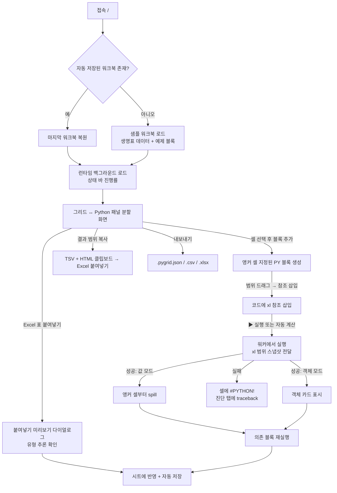

# PyGrid Studio — 브라우저형 Python in Excel 웹앱 개발 설계서

> **버전**: v1.0 (2026-09-02) · **작성 기준**: 웹페이지 개발 에이전트 시스템 설계 지침
> **기술 스택**: Next.js 15 (App Router) · TypeScript · Tailwind CSS · shadcn/ui + TweakCN · Pyodide(브라우저 WASM) · **Supabase 미사용(로컬 전용)**
> **확정된 결정**: Python 실행 엔진은 Pyodide(서버 없음), 저장은 IndexedDB(로그인 없음)

---

## 1. 프로젝트 컨텍스트

### 1.1 배경과 목적

- Microsoft 365의 **Python in Excel**은 셀에 `=PY()`를 입력하면 `xl("A1:B10", headers=True)` 같은 참조로 시트 데이터를 DataFrame으로 받아 Python을 실행하고, 결과를 셀 값으로 흘려보내거나(spill) Python 객체 카드로 보여준다. 초보자에게는 "데이터를 눈으로 보면서 곧바로 코드에 넣고, 중간 결과를 다시 셀에서 확인한다"는 점이 가장 큰 장점이다.
- 이 앱은 그 경험을 **브라우저에서 서버 없이** 재현한다. 스프레드시트 그리드에 데이터를 붙여넣고, 범위를 선택해 `xl()` 참조로 만들고, Python 블록을 실행해 결과를 그리드·객체 카드·이미지로 확인한다. 코드는 셀 안이 아니라 우측 **Python 패널**에서 작성한다(Excel의 Python Editor 창과 같은 구조).
- 입출력은 **복사·붙여넣기**로 Excel과 연계한다. Excel에서 복사한 표를 붙여넣으면 곧바로 시트가 되고, 결과 범위를 복사하면 Excel에 값으로 붙는다.
- 1차 사용 시나리오는 보험계리·통계 강의(학부)와 실무자의 가벼운 데이터 분석이다. Python 설치 없이 링크 하나로 실습 환경이 열린다는 점이 교육용 핵심 가치다.

### 1.2 대상 사용자

| 사용자 | 상황 | 필요 기능 |
|--------|------|----------|
| 초보자 (학생·실무자) | Excel 표를 붙여넣고 pandas 기초 연습 | 범위 클릭 → `xl()` 자동 삽입, 코드 스니펫, 결과를 셀에서 확인, 오류 메시지 한국어 안내 |
| 강의자 | 수업 중 시연, 실습 파일 배포 | 샘플 워크북, 워크북 JSON 내보내기·열기, 전체 실행, 런타임 재설정 |
| 숙련자 | 빠른 분석 스크래치패드 | 콘솔 탭, 변수 검사, 다중 블록 의존성 자동 재계산, CSV/XLSX 열기 |

### 1.3 핵심 기능 요약

1. **스프레드시트 그리드** — 다중 시트, 셀 값 편집, 행/열 삽입·삭제, 정렬, 열 고정, Ctrl+Z. Excel 수식은 v1 범위 밖이며 계산은 Python이 담당한다.
2. **클립보드 왕복** — Excel에서 복사한 표(TSV + HTML) 붙여넣기 시 유형 추론(숫자·퍼센트·날짜·불리언), 그리드 범위 복사 시 Excel이 값으로 인식하는 TSV/HTML 생성.
3. **PY 블록(핵심)** — 앵커 셀을 가진 Python 코드 블록. `xl()`로 시트 데이터를 참조하고, 마지막 표현식의 값이 출력이 된다. 출력 모드는 **Excel 값(spill)** 또는 **Python 객체(카드)**.
4. **계산 엔진** — Excel과 같은 좌→우·상→하·시트 순 기본 순서에 `xl()` 의존성 그래프를 결합해 변경된 블록과 그 하위 블록만 재실행. 자동/수동 계산 모드, 타임아웃·중단.
5. **중간 확인 도구** — 하단 패널의 진단(stdout/stderr/traceback), 출력 미리보기(DataFrame 상위 행), 변수 검사(런타임 전역 변수 목록), 콘솔(REPL).
6. **파일 입출력** — CSV/XLSX 열기(SheetJS), 워크북 JSON 저장·열기, 브라우저 자동 저장(IndexedDB), 최근 워크북.

### 1.4 Python in Excel 대응표

| Python in Excel | PyGrid Studio v1 | 비고 |
|-----------------|------------------|------|
| `=PY(python_code, return_type)` 셀 | PY 블록 + 앵커 셀 | 코드는 Python 패널에서 편집, 셀에는 결과만 표시 |
| `return_type` 0(Excel 값)/1(Python 객체) | 출력 모드 `values`/`object` | 셀 우클릭 메뉴·블록 헤더에서 전환 |
| `xl("A1:B10", headers=True)` | 동일 시그니처 | `Sheet2!A1:C5` 시트 참조 지원. 표(`Table1[#All]`)·이름·Power Query·이미지 참조는 v2 |
| 편집 중 범위 드래그 → `xl()` 자동 삽입 | 동일 | 그리드 선택 후 "참조 삽입" 또는 단축키 |
| 계산 순서: 좌→우·상→하, 시트 왼쪽부터 | 동일한 기본 순서 + 의존성 우선 | Excel은 뒤쪽 셀을 참조하면 이전 값을 읽지만, 이 앱은 의존성을 따라 먼저 실행한다(§2.4) |
| 워크북 단위 공유 런타임(변수 공유) | 동일 | "런타임 재설정" 버튼 |
| Python Editor 창 | Python 패널 | 계산 순서대로 블록 나열, 블록 클릭 시 앵커 셀로 이동 |
| 진단(Diagnostics) 창 | 진단 탭 | 블록별 stdout/stderr/traceback |
| 초기화(Initialization) 스크립트 | 동일 | 기본 import 편집 가능 |
| 자동/부분/수동 계산 | 자동/수동 | 부분(Partial)은 v2 |
| `#PYTHON!`, `#BUSY!`, `#SPILL!` | 동일 표기 | 셀에 오류 코드, hover 시 상세 |
| DataFrame 카드 → 값으로 변환 | 객체 카드 → "값으로 펼치기" | |
| matplotlib 이미지 카드 | 이미지 객체 카드 | 시트 위 이미지 배치는 v2 |
| Microsoft 클라우드 실행 | 브라우저 WASM(Pyodide) | 데이터가 브라우저 밖으로 나가지 않음 |
| Excel 수식과 혼용 | 미지원(v1) | 계산은 전부 Python |
| Copilot·Advanced Analysis | 범위 밖 | |

### 1.5 입력과 출력

- **입력**: 직접 타이핑, Excel/Google Sheets에서 복사한 표 붙여넣기, CSV/XLSX 파일(드래그 앤 드롭), 워크북 JSON(`.pygrid.json`), 브라우저 자동 저장 세션, 샘플 워크북.
- **출력**: 그리드 범위 복사(TSV + HTML), CSV/XLSX 다운로드(값만), 워크북 JSON 다운로드(시트 + 블록 코드 + 초기화 스크립트), 이미지 PNG 복사·다운로드, 블록 코드 복사(`.py`).

### 1.6 제약조건

- **서버 의존성 제로**: 로그인·DB 없음. Vercel 정적 배포. Pyodide 자산은 jsDelivr CDN(버전 고정)에서 로드하고, 필요 시 `public/pyodide/`로 셀프 호스팅 전환이 가능해야 한다.
- **성능 목표**: 첫 방문 시 Pyodide + numpy + pandas 로드 15초 이내(100Mbps 기준), 재방문 시 브라우저 캐시로 5초 이내. 그리드는 10,000행 × 50열 붙여넣기 2초 이내, 스크롤 60fps. `xl()`로 10만 셀 전달 500ms 이내. 블록 실행의 코드 외 오버헤드(전달·변환·spill) 100ms 이내.
- **메모리**: WASM 힙은 브라우저 탭 한도에 종속된다. 워크북 JSON 50MB 초과 시 경고, 100MB 초과 시 저장 거부 후 파일 다운로드로 대피 유도.
- **보안**: Python 코드는 WASM 샌드박스 안에서만 실행된다. 네트워크 접근은 `pyodide.http.pyfetch`(CORS 허용 서버만)로 제한적으로 가능하며, 앱은 어떤 비밀값도 갖지 않는다.
- **인터럽트 요건**: 실행 중단은 `SharedArrayBuffer` 기반 인터럽트 버퍼를 쓰므로 `Cross-Origin-Opener-Policy: same-origin`, `Cross-Origin-Embedder-Policy: require-corp` 헤더가 필요하다. CDN 자산은 CORS 모드로 로드해 호환한다. 헤더 설정 불가 환경에서는 워커 종료 후 재시작으로 폴백한다.
- **접근성**: 그리드 키보드 이동(방향키·Tab·Enter·F2), 패널 간 포커스 이동 단축키, 색 대비 4.5:1 이상.
- **UI 언어**: 한국어. 오류 메시지는 Python traceback 원문 + 한국어 요약(패턴 매핑: `NameError`, `KeyError`, `ValueError` 등 상위 10종).

### 1.7 용어 정의

| 용어 | 정의 |
|------|------|
| 워크북 | 시트 여러 개 + PY 블록 + 초기화 스크립트 + 설정을 묶은 저장 단위 |
| PY 블록 | Python 코드 한 덩어리. 앵커 셀(결과가 놓이는 셀), 출력 모드, 마지막 실행 결과를 가진다 |
| 앵커 셀 | 블록 결과가 표시되는 셀. 값 모드에서는 spill의 좌상단, 객체 모드에서는 카드가 놓이는 셀 |
| spill 범위 | 값 모드 결과가 차지하는 직사각형 범위. 셀은 잠기며 `src`로 블록 id를 기억한다 |
| 객체 카드 | 객체 모드 결과를 셀 안에 요약(타입·shape)으로 보여주는 표시. 클릭 시 하단 패널에서 미리보기 |
| `xl()` | 시트 범위를 Python 값으로 가져오는 함수. 문자열 리터럴 참조만 허용(Excel과 동일)하며, 정적 분석으로 의존성을 추출한다 |
| 런타임 | 워크북당 하나인 Pyodide 인터프리터(Web Worker). 전역 네임스페이스를 모든 블록이 공유한다 |
| 계산 순서 | 시트 순 → 앵커 셀 행 우선(좌→우·상→하)을 기본으로 하고, `xl()` 의존성이 있으면 선행 블록을 먼저 실행하는 순서 |

---

## 2. 페이지 목록 및 사용자 흐름

### 2.1 페이지 목록

| 경로 | 페이지명 | 설명 | 인증 필요 |
|------|--------|------|---------|
| `/` | 워크북 편집기 (단일 화면) | 그리드 + Python 패널 + 하단 패널 + 헤더/툴바/상태 바. 앱의 전부 | 불필요 |

문서 전환은 헤더의 "최근 워크북" 드롭다운과 파일 열기/저장으로 처리하며, 별도 목록 페이지를 두지 않는다.

### 2.2 사용자 흐름 다이어그램



### 2.3 블록 편집 흐름 (핵심 UX)

1. **블록 추가**: 그리드에서 결과를 놓을 셀을 선택한 뒤 Python 패널 헤더의 "＋ Python 블록"(단축키 `Ctrl+Shift+P`)을 누른다. Python 패널에 새 블록이 계산 순서 위치에 삽입되고, 편집기에 포커스가 간다. 앵커 셀에는 `[PY]` 배지가 표시된다.
2. **참조 삽입**: 편집기에 커서를 둔 채 그리드에서 범위를 드래그하면 하단에 "`xl("A1:F21", headers=True)` 삽입" 버튼이 뜬다(`Enter`로 삽입). 첫 행이 문자열이고 나머지가 숫자면 `headers=True`를 기본으로 제안한다. 우클릭 메뉴 "참조 복사"도 제공한다.
3. **실행**: 블록 헤더 ▶(`Ctrl+Enter`)로 단일 실행, Python 패널 헤더 "전체 실행"으로 계산 순서 일괄 실행. 자동 계산 모드에서는 코드 저장 또는 참조 범위 변경 후 500ms 디바운스로 자동 실행된다.
4. **결과 확인**: 값 모드면 앵커 셀부터 spill(파란 테두리), 객체 모드면 카드. 카드 클릭 시 하단 "출력 미리보기" 탭에 DataFrame 상위 100행·shape·dtypes, 이미지, 또는 `repr` 표시. 실행 성공 시 spill 범위에 400ms 하이라이트.
5. **중간 데이터 확인**: 하단 "변수" 탭에 런타임 전역 변수(이름·타입·shape) 목록. 항목 클릭 → 미리보기, "새 시트로 내보내기"로 DataFrame을 시트로 복사. "콘솔" 탭은 같은 런타임을 공유하는 REPL로, 워크북에 저장되지 않고 계산 순서에도 포함되지 않는다.
6. **출력 모드 전환**: 블록 헤더 토글 또는 앵커 셀 우클릭 "Python 출력 → Excel 값 / Python 객체". 객체 → 값 전환 시 spill 충돌을 먼저 검사한다.
7. **오류**: 앵커 셀에 `#PYTHON!`(실행 오류), `#BUSY!`(실행 중), `#SPILL!`(spill 충돌) 표시. hover 툴팁에 한국어 요약, 클릭 시 진단 탭으로 이동.

### 2.4 계산 순서와 의존성 규칙

| 규칙 | 내용 |
|------|------|
| 기본 순서 | 시트 순서 → 앵커 셀 행 번호 → 열 번호(Excel과 동일) |
| 의존성 추출 | 블록 실행 전 Python `ast`로 `xl("...")` 리터럴 인수를 추출한다. 문자열 리터럴이 아닌 인수는 실행 전에 `#PYTHON! xl() 인수는 문자열 리터럴이어야 합니다`로 거부한다(Excel과 동일한 제약) |
| 의존 관계 | 블록 B의 참조 범위가 블록 A의 spill 범위(값 모드) 또는 앵커 셀(객체 모드)과 겹치면 B는 A에 의존한다 |
| 실행 순서 | 의존성 그래프의 위상 정렬을 따르되 동순위는 기본 순서로 결정한다. 순환이 발견되면 순환에 속한 블록 전부를 `#PYTHON! 순환 참조`로 표시한다 |
| 재계산 대상 | 셀 편집 → 편집 범위와 참조가 겹치는 블록을 dirty로 표시. 코드 수정 → 그 블록을 dirty로 표시. dirty 블록과 그 하위(의존하는) 블록만 재실행한다 |
| 변수 공유 | 전역 네임스페이스는 공유되지만 의존성 추적은 `xl()` 참조만 다룬다. 변수만으로 이어진 블록은 "전체 실행"에서만 순서가 보장된다는 점을 UI에 안내한다(Excel과 동일한 한계) |
| 자동/수동 | 기본값은 자동(Excel과 동일). 상태 바에서 수동으로 전환하면 dirty 블록에 주황 점이 표시되고 ▶로만 실행된다 |
| 타임아웃·중단 | 블록당 기본 60초(설정 가능). 초과 또는 중단 버튼 시 인터럽트 버퍼로 `KeyboardInterrupt`를 보낸다. 실패하면 워커를 종료·재시작하고 "런타임이 재설정되어 변수가 초기화되었습니다"를 안내한다 |

### 2.5 데이터 흐름

```
입력(타이핑/붙여넣기/CSV·XLSX)
  → 워크북 상태 (Zustand 스토어, 단일 소스 오브 트루스: sheets + pyBlocks)
  → [셀 편집·코드 저장] dirty 블록 계산 → 계산 엔진이 실행 큐 생성
  → 메인 스레드: 블록의 xl() 참조 범위를 2D 배열 스냅샷으로 직렬화
  → 워커(Pyodide): 스냅샷을 xl() 캐시에 주입 → 코드 실행 → 마지막 표현식 값 변환
       · values 모드: 2D 셀 배열 + dtype 힌트
       · object 모드: 요약(타입·shape·미리보기 100행) + 이미지면 PNG bytes
       · stdout/stderr/traceback
  → 메인 스레드: spill 충돌 검사 → 셀 반영(src=blockId) → 하위 블록 실행
  → IndexedDB 자동 저장 (편집 멈춤 2초 후, 워크북 JSON + 이미지 blob 분리)
출력(복사) → 선택 범위 → TSV(text/plain) + <table>(text/html, 숫자·날짜 서식 유지)
```

### 2.6 LLM 판단 영역과 코드 처리 영역

런타임에 LLM은 사용하지 않는다(전 기능 결정론적). LLM 판단은 구현 단계의 Claude Code 에이전트에만 해당한다.

| 에이전트가 직접 판단 (구현 시) | 코드·스크립트로 처리 |
|------|------|
| 워커 메시지 프로토콜과 상태 동기화 구조 설계 | Pyodide 로드·패키지 로드 보일러플레이트 |
| Excel ↔ Python 값 변환 경계 케이스(날짜 텍스트, 빈 셀, 혼합 dtype) 판정 | 클립보드 픽스처·샘플 워크북 JSON 생성 스크립트 |
| spill 충돌·순환 참조 처리 정책 | A1 참조 파서, 위상 정렬, 타입 생성 |
| 초보자용 오류 한국어 매핑 문구 | 빌드·타입 검사·vitest·Playwright 실행 |
| TweakCN 톤과 그리드 시각 밀도 결정 | 컴포넌트 스캐폴딩 |

---

## 3. 데이터 모델 (Supabase 미사용 — 브라우저 로컬)

### 3.1 워크북 JSON 구조 (저장·내보내기 공통)

```ts
Workbook {
  id: string            // uuid
  version: 1            // 스키마 버전 (마이그레이션용)
  title: string
  sheets: Sheet[]
  pyBlocks: PyBlock[]
  initScript: string    // 초기화 스크립트
  calcMode: 'auto' | 'manual'
  settings: { timeoutSec: number; inferTypesOnPaste: boolean }
  createdAt: string; updatedAt: string
}
Sheet {
  id: string; name: string
  rowCount: number; colCount: number
  cells: Record<string, Cell>      // key "r:c" (0-based), 빈 셀은 저장하지 않음
  colWidths?: Record<number, number>; frozenCols?: number
}
Cell {
  v: string | number | boolean | null
  t: 'n' | 's' | 'b' | 'd' | 'e'   // number, string, boolean, date(ISO 문자열), error
  f?: string                       // 표시 서식 힌트 ('0.0%', '#,##0', 'yyyy-mm-dd')
  src?: string                     // spill 출처 블록 id (있으면 잠김)
}
PyBlock {
  id: string; sheetId: string
  anchor: { r: number; c: number }
  code: string
  outputMode: 'values' | 'object'
  includeIndex: 'auto' | 'always' | 'never'   // DataFrame spill 시 index 포함 규칙
  last?: RunResult
}
RunResult {
  status: 'ok' | 'error' | 'busy' | 'spill'
  kind?: 'scalar' | 'table' | 'image' | 'object'
  shape?: [number, number]; preview?: unknown  // 상위 100행 또는 repr
  imageBlobId?: string                          // blobs 스토어 참조
  stdout: string; stderr: string; traceback?: string; summaryKo?: string
  spillRange?: { r0: number; c0: number; r1: number; c1: number }
  durationMs: number; ranAt: string
}
```

### 3.2 IndexedDB 스토어 (`idb` 래퍼)

| 스토어 | 키 | 값 | 용도 |
|--------|----|----|------|
| `workbooks` | `id` | `Workbook` (이미지 제외) | 자동 저장 + 최근 목록(최대 20개, LRU 정리) |
| `blobs` | `id` | `Blob` (PNG 등) | 이미지 결과. 워크북 삭제 시 함께 정리 |
| `settings` | `'app'` | `{ theme, splitRatio, bottomPanelHeight, fontSize, lastWorkbookId, pyodideIndexUrl? }` | 앱 설정 |

### 3.3 Excel ↔ Python 값 변환 규칙

| 방향 | Excel/그리드 | Python | 비고 |
|------|-------------|--------|------|
| 입력 | `t:'n'` | `int`/`float` (열 전체가 정수면 int64) | 천단위 콤마·퍼센트는 붙여넣기 시 이미 숫자로 정규화 |
| 입력 | `t:'s'` | `str` (pandas `object`) | |
| 입력 | `t:'b'` | `bool` | Excel의 TRUE/FALSE 텍스트 인식 |
| 입력 | `t:'d'` | `pandas.Timestamp` (`datetime64[ns]`) | ISO 저장. 시간대 없음 |
| 입력 | 빈 셀 | `None` → 열에 따라 `NaN`/`NaT`/`None` | |
| 입력 | 단일 셀 `xl("A1")` | 스칼라 | 2D가 아닌 값 |
| 출력 | 스칼라 | 1셀 | `None` → 빈 셀, `bool` → `t:'b'` |
| 출력 | `list`/1D `ndarray`/`Series` | 세로 1열 | Series는 `name`을 헤더로 |
| 출력 | 중첩 `list`/2D `ndarray` | 2D spill | |
| 출력 | `DataFrame` | 헤더 행 + 값. `includeIndex:'auto'`면 RangeIndex는 제외, 그 외 index는 첫 열로 | Excel의 기본 동작과 맞춘 규칙 |
| 출력 | `dict` | 2열(키·값) | |
| 출력 | `datetime`/`Timestamp` | `t:'d'` ISO | 복사 시 HTML에서 날짜 서식 유지 |
| 출력 | `matplotlib.figure.Figure` | 이미지 객체(PNG, dpi 150) | 값 모드에서는 `#PYTHON! 이미지는 값으로 펼칠 수 없습니다` |
| 출력 | 그 외 객체 | 객체 카드 + `repr` | 값 모드에서는 `str()` 1셀 |

### 3.4 원칙

- 자동 저장은 편집 멈춤 2초 후 실행하고, 실패(용량·시크릿 모드) 시 상단 배너로 파일 다운로드를 유도한다. IndexedDB 접근은 전부 try/catch로 감싸고 메모리 저장으로 강등한다.
- spill 셀(`src` 존재)은 직접 편집을 막고, 편집 시도 시 "블록 ○○의 결과입니다. 코드를 수정하거나 블록을 삭제하세요" 툴팁을 띄운다.
- 향후 Supabase 공유를 대비해 `id`/`version`/`updatedAt`을 처음부터 포함한다.

---

## 4. UI/UX 방향

### 4.1 디자인 컨셉

- **톤**: 미니멀 워크벤치(뉴트럴 라이트). 근거: 강의실 프로젝터에서 잘 보이는 흰 캔버스가 필요하고, 초보자에게 다크 테크 톤은 위압적이다. 도구는 물러나고 데이터 그리드와 결과가 주인공이다. tkLeen 브랜드의 Sky Blue `#4A90C2`는 실행·선택·spill 등 "Python이 관여한 곳"을 표시하는 색으로만 쓴다.
- **폰트**: Fraunces(로고·워크북 제목), Pretendard(UI·그리드 텍스트, `font-variant-numeric: tabular-nums`), JetBrains Mono(코드 편집기·콘솔·셀 주소·메타 정보).
- **브랜드 자산**: 로고 SVG·색 토큰은 `00-BRAND-GUIDE.md`(tkleen-project-knowledge.zip)가 마스터. 구현 시 `/docs/references/`에 복사한다.

### 4.2 컬러 토큰 (TweakCN 기반)

| 토큰 | 값 | 용도 |
|------|----|------|
| `--primary` | `#4A90C2` (Sky Blue, 고정) | 실행 버튼, spill 테두리, 활성 탭, 선택 범위 |
| `--primary-foreground` | `#FFFFFF` | primary 위 텍스트 |
| `--background` | `#FDFCFA` | 앱 배경 |
| `--muted` | `#F1F3F5` | 툴바·패널 헤더·그리드 헤더 행 |
| `--accent` | `#EAF3FA` (Sky Blue 10%) | spill 셀 배경, 참조 범위 hover, 성공 플래시 |
| `--border` | `#E2E5E9` | 그리드 선, 분할선 |
| `--destructive` | `#C2504A` | `#PYTHON!` 셀, 오류 배지 |
| `--warning` | `#D9A441` | dirty 표시, `#BUSY!`, 수동 모드 배지 |
| `--code-bg` | `#F7F8FA` | 편집기·콘솔 배경 |

### 4.3 화면 레이아웃

```
┌──────────────────────────────────────────────────────────────────────┐
│ 헤더: 로고 · 워크북 제목 · 최근 ▾ · 열기/저장/내보내기 · 런타임 ● 준비됨   │
├──────────────────────────────────────────────────────────────────────┤
│ 툴바: ⊞시트접기 │ 붙여넣기(유형 추론 ☑) · 행/열 · 정렬 · 열 고정 · 서식        ⟨/⟩Python접기 │
├───────────────────────────────────────┬──────────────────────────────┤
│ 시트 탭 [데이터][결과][+]               │ 블록 2 ＋Py ▶전체 ■중단 자동▾ │
│  ┌ A ─── B ─── C ─── D ─── E ──┐       │ ┌ 블록 1  데이터!H2  값▾  ▶ ┐ │
│  1 연령  qx     lx    ...            │ │ df = xl("A1:C101",        │ │
│  2 …                                 │ │      headers=True)        │ │
│  … [PY] H2 ┌ spill 파란 테두리 ┐      │ │ df.describe()             │ │
│            │ count mean std   │      │ └───────────────────────────┘ │
│            └──────────────────┘      │ ┌ 블록 2  결과!A1  객체▾  ▶ ┐ │
│  [DataFrame 5×3] ← 객체 카드          │ │ …                         │ │
│                                       │ └───────────────────────────┘ │
├───────────────────────────────────────┴──────────────────────────────┤
│ 하단 패널: [진단] [출력 미리보기] [변수] [콘솔]                            │
├──────────────────────────────────────────────────────────────────────┤
│ 상태 바: 선택 A1:C101 · 시트 3 · 블록 2(dirty 1) · 계산 자동 · 자동 저장 ✓ │
└──────────────────────────────────────────────────────────────────────┘
```

### 4.4 핵심 컴포넌트 목록

| 컴포넌트 | 역할 |
|----------|------|
| `WorkbookShell` | 전체 레이아웃, 분할 비율·하단 패널 높이 조절, 단축키 라우팅 |
| `SheetGrid` | Glide Data Grid 래퍼. 셀 렌더(타입별 정렬·서식), spill 테두리, `[PY]` 배지, 객체 카드 셀, 오류 셀, 선택 → 참조 삽입 이벤트 |
| `SheetTabs` | 시트 추가·이름 변경·순서 변경(계산 순서에 영향) |
| `SheetEditToolbar` | (그리드 패널 안) 붙여넣기 옵션, 행/열 삽입·삭제, 정렬, 열 고정, 굵게·글자 크기 — 스프레드시트를 접으면 함께 사라진다 |
| `ShellBar` | (2행) 스프레드시트 접기, 파일·샘플·최근 워크북 메뉴, ? 단축키, Python 패널 접기(+접힘 시 전체 실행) |
| `PasteImportDialog` | 붙여넣기 미리보기(상위 20행), 열별 추론 유형 표시·수정, 헤더 행 여부, 대상 위치(현재 셀/새 시트) |
| `PythonPanel` | 블록 목록(계산 순서), 접기/펼치기, 드래그 없음(순서는 앵커가 결정), 초기화 스크립트 열기 |
| `PyBlockCard` | 블록 헤더(앵커 주소, 출력 모드, 상태 배지, ▶/■/삭제) + `CodeEditor` + 참조 삽입 바 |
| `CodeEditor` | CodeMirror 6(`@codemirror/lang-python`), `xl()` 리터럴 하이라이트, hover 시 그리드 범위 하이라이트, 스니펫 삽입 |
| `SnippetMenu` | 초보자용 코드 스니펫(기술통계·그룹 집계·피벗·히스토그램·선형회귀·생명표 lx 계산 등, `data/snippets.json`) |
| `ObjectCardCell` | 셀 안 객체 카드 렌더(아이콘·타입·shape), 클릭 → 미리보기 |
| `BottomPanel` | 탭 컨테이너 |
| `DiagnosticsTab` | 블록별 stdout/stderr/traceback + 한국어 요약, 블록·셀로 이동 링크 |
| `OutputPreviewTab` | DataFrame 상위 100행 표(정렬 가능), 이미지, `repr`. "새 시트로 내보내기", PNG 복사 |
| `VariablesTab` | 런타임 전역 변수 목록(이름·타입·shape·메모리), 클릭 → 미리보기 |
| `ConsoleTab` | REPL(입력 히스토리, 같은 네임스페이스) |
| `RuntimeStatus` | 로드 진행률, 준비/실행 중/오류, 런타임 재설정 |
| `FileMenu` | 열기(드래그 앤 드롭), 저장(.pygrid.json), 내보내기(csv/xlsx), 최근 워크북 |
| `StatusBar` | 선택 범위, 셀·블록 수, dirty 수, 계산 모드 토글, 자동 저장 상태 |
| `InitScriptDialog` | 초기화 스크립트 편집 + "런타임 재설정 후 적용" |

### 4.5 클립보드 상세 (핵심 요구사항)

1. **붙여넣기 감지**: 그리드 포커스 상태의 `paste` 이벤트에서 `text/html`과 `text/plain`을 모두 읽는다. HTML `<table>`이 있으면 셀 경계는 HTML에서(줄바꿈 포함 셀 안전), 값은 텍스트에서 취한다. HTML이 없으면 TSV 파서(따옴표·줄바꿈 셀 처리).
2. **유형 추론(열 단위)**: 숫자(`1,234`, `-3.5`, `1.2e5`), 퍼센트(`12.5%` → `0.125`, `f:'0.0%'`), 날짜(`2026-09-02`, `2026. 9. 2`, `2026/09/02`, `9/2/2026`은 설정의 날짜 순서 옵션), 불리언(`TRUE/FALSE`), 나머지 문자열. 열의 90% 이상이 한 유형이면 그 유형으로, 아니면 문자열. 추론은 `PasteImportDialog`에서 열별로 수정 가능하다.
3. **다이얼로그 생략**: 5행 이하 또는 단일 셀 붙여넣기는 다이얼로그 없이 즉시 반영한다(설정에서 항상 표시로 변경 가능).
4. **복사**: 선택 범위를 `text/plain`(TSV, 숫자는 서식 없는 원값)과 `text/html`(`<table>`, 각 `<td>`에 `style="mso-number-format:..."`로 날짜·퍼센트 서식 힌트)로 동시에 쓴다. 객체 카드 셀은 `repr` 첫 줄을, 오류 셀은 오류 코드를 복사한다.
5. **모바일·권한 폴백**: 붙여넣기 권한이 막힌 환경을 위해 "텍스트로 붙여넣기" 다이얼로그(textarea)를 툴바에 둔다.
6. **왕복 보장**: Excel → 붙여넣기 → 복사 → Excel 왕복에서 숫자·날짜·텍스트가 동일해야 한다(§5.9 G1).

### 4.6 TweakCN 커스터마이징 대상

| 컴포넌트 | 변경 방향 |
|----------|----------|
| `Button` | 라운딩 6px, 툴바용 ghost 아이콘 변형(32px), 실행 버튼은 `--primary` 채움 |
| `Tabs` | 하단 패널·시트 탭용 언더라인 스타일, `--primary` 인디케이터, 탭에 배지(오류 수) 슬롯 |
| `Resizable` | 좌우·상하 분할 핸들 6px, hover 시 `--primary` |
| `ContextMenu` | 셀 우클릭(Python 출력 모드, 참조 복사, 블록으로 이동, 행/열 삽입·삭제) |
| `Dialog` | 붙여넣기 미리보기·설정·초기화 스크립트, 배경 blur 6px, 최대 폭 880px |
| `Badge` | 블록 상태 4종(준비·실행 중·오류·dirty) 색 매핑 |
| `Tooltip` | 단축키 병기(`실행 Ctrl+Enter`), 오류 요약용 다중 행 변형 |
| `DropdownMenu` | 최근 워크북·내보내기, JetBrains Mono 메타 표기 |
| `Sonner`(toast) | 실행 완료·저장 실패·런타임 재설정 알림 |
| `Progress` | 런타임 로드 진행률(상태 바 인라인) |

### 4.7 반응형 전략

| 브레이크포인트 | 레이아웃 |
|---------------|---------|
| ≥ 1280px | 그리드 · Python 패널 좌우 분할 + 하단 패널 |
| 1024–1279px | Python 패널을 접이식 사이드 시트로, 하단 패널 유지 (v2.0: 그리드·Python 접기는 lg·xl 전 구간, 그리드 최소 폭 15%) |
| 640–1023px | 탭 전환(그리드 ↔ Python ↔ 결과) |
| < 640px | 열람 우선. 그리드 스크롤·객체 카드 미리보기·실행은 가능, 코드 편집은 전체 화면 편집기로 전환. 붙여넣기는 텍스트 다이얼로그 |

### 4.8 애니메이션·인터랙션

- 실행 성공 시 spill 범위 400ms `--accent` 플래시, 실패 시 앵커 셀 200ms 흔들림 없이 색만 전환(과한 모션 배제).
- 편집기에서 `xl("A1:C10")` 위에 커서를 올리면 그리드 해당 범위를 `--primary` 점선으로 하이라이트하고, 반대로 spill 범위 hover 시 Python 패널의 해당 블록을 강조한다.
- 런타임 로드 중에는 블록 실행 버튼을 비활성화하지 않고 큐에 넣은 뒤 "런타임 준비 후 실행됩니다"를 표시한다.

---

## 5. 구현 스펙

### 5.1 기술 선택 및 근거

| 영역 | 선택 | 근거 |
|------|------|------|
| 프레임워크 | Next.js 15 App Router, 전 컴포넌트 client-side | 사용자 표준 스택. 서버 기능 불필요. Pyodide는 SSR에서 import하지 않도록 `dynamic(..., { ssr: false })` |
| Python 런타임 | **Pyodide** 최신 안정 버전 고정(설계 시점 314.0.6, 2026-08-25, Python 3.14.2) | 서버 없이 pandas·numpy·matplotlib·scipy·statsmodels·scikit-learn 사용 가능. 314.0.0부터 `pyodide.asm.mjs`(ES 모듈)만 지원하므로 **모듈 워커**(`new Worker(url, { type: 'module' })`)로 로드한다 |
| 워커 통신 | 자체 메시지 프로토콜(`lib/runtime/protocol.ts`) + `Comlink` 미사용 | 진행률·stdout 스트리밍·인터럽트처럼 비요청형 메시지가 많아 명시적 프로토콜이 낫다 |
| 그리드 | **Glide Data Grid**(MIT, 캔버스 가상화) | 10만 셀 이상에서 60fps, 복사·붙여넣기·셀 편집·커스텀 셀 렌더 내장. 구현 착수 시 유지보수 상태를 확인하고, 문제가 있으면 `react-data-grid`로 대체(폴백 기준: 최근 12개월 릴리스 없음) |
| 코드 편집기 | CodeMirror 6 + `@codemirror/lang-python` | 경량, 데코레이션 API로 `xl()` 하이라이트 구현 용이 |
| 상태 관리 | Zustand + Immer | 셀 단위 부분 갱신, undo 스택(`zundo`) |
| 로컬 저장 | IndexedDB(`idb`) | 다건 워크북·이미지 blob |
| 파일 I/O | SheetJS(`xlsx`) CE | CSV/XLSX 읽기·쓰기(값만) |
| 참조 파싱 | 자체 A1 파서(`lib/grid/a1.ts`) | `A1`, `A1:C10`, `Sheet2!A1`, `'시트 이름'!A1:B2` |
| 테스트 | vitest(변환·파서·계산 엔진), pytest 없이 Pyodide 내부 Python 코드는 vitest에서 Node용 Pyodide로 실행, Playwright(E2E) | |

**Pyodide 관련 구현 주의점**(CLAUDE.md에 기재):
- matplotlib 기본 백엔드가 0.28부터 `webagg`이므로 초기화 스크립트에서 `matplotlib.use("Agg")`를 고정하고 `savefig`로 PNG를 만든다.
- 한글 폰트: `public/fonts/Pretendard-Regular.otf`(또는 Noto Sans KR)를 워커 시작 시 Pyodide FS에 쓰고 `font_manager.fontManager.addfont()` + `rcParams['font.family']`로 등록한다. 미등록 시 한글이 □로 깨진다.
- 패키지는 `loadPyodide({ packages: ['numpy', 'pandas'] })`로 부트 시 선로드하고, 그 외(matplotlib·scipy·statsmodels·scikit-learn·seaborn)는 `loadPackagesFromImports`로 첫 import 때 지연 로드한다. v1의 micropip은 화이트리스트 밖 설치를 막는다.
- JS ↔ Python 변환은 dict/객체·`null` 처리 규칙이 버전에 따라 바뀌므로 변환은 `convert.py`(Python 측)에서 JSON 직렬화 가능한 형태로 통일한 뒤 넘긴다. `PyProxy`를 메인 스레드로 넘기지 않는다.
- 초기화 기본 스크립트: `import pandas as pd; import numpy as np; import matplotlib; matplotlib.use("Agg"); import matplotlib.pyplot as plt`. Excel의 기본 import(pandas·numpy·matplotlib·seaborn·statsmodels)와 맞추되 seaborn·statsmodels는 지연 로드.
- COOP/COEP 헤더는 `next.config.ts`의 `headers()`로 설정한다. 정적 export(`output: 'export'`)를 택할 경우 `vercel.json`의 headers로 대체한다.

### 5.2 폴더 구조

```
/pygrid-studio
  ├── CLAUDE.md                          # 메인 에이전트(오케스트레이터) 지침
  ├── .claude/
  │   ├── agents/
  │   │   ├── py-runtime/AGENT.md        # 워커·xl 브리지·변환·계산 엔진
  │   │   └── grid-ui/AGENT.md           # 그리드·패널·클립보드·TweakCN
  │   └── skills/
  │       ├── clipboard-fixture-gen/     # SKILL.md + scripts/build_fixtures.py
  │       └── sample-workbook-gen/       # SKILL.md + scripts/build_samples.py
  ├── app/
  │   ├── layout.tsx                     # 폰트, 테마 토큰
  │   └── page.tsx                       # WorkbookShell 마운트 (ssr: false)
  ├── components/
  │   ├── ui/                            # TweakCN 커스터마이징 컴포넌트
  │   ├── shell/                         # WorkbookShell, Header, ShellBar, StatusBar, FileMenu
  │   ├── grid/                          # SheetGrid, SheetTabs, SheetEditToolbar, PasteImportDialog, ObjectCardCell
  │   ├── python/                        # PythonPanel, PyBlockCard, CodeEditor, SnippetMenu, InitScriptDialog
  │   └── panels/                        # BottomPanel, DiagnosticsTab, OutputPreviewTab, VariablesTab, ConsoleTab
  ├── lib/
  │   ├── grid/                          # 워크북 모델, a1.ts, clipboard/(parse·infer·serialize), spill.ts
  │   ├── runtime/
  │   │   ├── protocol.ts                # 워커 메시지 타입 (계약)
  │   │   ├── client.ts                  # 메인 스레드 런타임 클라이언트
  │   │   ├── calc-engine.ts             # 의존성 그래프·위상 정렬·dirty 전파
  │   │   ├── converters.ts              # 결과 → Cell[][] 변환(TS 측)
  │   │   └── py/                        # xl.py, convert.py, init_default.py (문자열로 번들)
  │   ├── storage/                       # IndexedDB 래퍼, 자동 저장 훅
  │   └── io/                            # csv·xlsx(SheetJS), workbook-json
  ├── workers/
  │   └── pyodide.worker.ts              # 모듈 워커: 로드·실행·인터럽트·stdout 스트리밍
  ├── data/
  │   ├── snippets.json                  # 코드 스니펫 (스크립트 산출물)
  │   └── sample-workbooks/              # 샘플 워크북 (생명표·손해율 예제)
  ├── types/
  ├── public/fonts/                      # Pretendard·JetBrains Mono·Fraunces + matplotlib용 한글 폰트
  ├── public/pyodide/                    # (선택) 셀프 호스팅 자산
  ├── tests/                             # vitest 단위·통합, e2e/ Playwright
  ├── output/                            # 에이전트 중간 산출물
  └── docs/
      ├── references/                    # 00-BRAND-GUIDE.md 사본, Pyodide·Glide 링크
      └── domain/
          ├── python-in-excel-parity.md  # §1.4 대응표의 상세 버전
          └── conversion-rules.md        # §3.3 변환 규칙 + 경계 케이스
```

### 5.3 CLAUDE.md 핵심 섹션 목록

1. 프로젝트 개요와 이 설계서 참조 경로, Python in Excel 대응 원칙("Excel과 다르게 동작하면 문서화")
2. 기술 스택·버전 고정 목록(Pyodide 버전, CDN URL, Glide 버전)
3. 워커 프로토콜 계약(`lib/runtime/protocol.ts`)과 변경 절차
4. Excel ↔ Python 변환 규칙과 spill·순환 참조 정책(§2.4, §3.3) — 가장 오류가 나기 쉬운 영역
5. Pyodide 구현 주의점(모듈 워커, Agg 백엔드, 한글 폰트, COOP/COEP)
6. tkLeen 브랜드 토큰과 TweakCN 변경 목록
7. 서브에이전트 호출 순서와 산출물 경로
8. 검증 명령(`tsc --noEmit`, `next build`, `vitest`, Playwright 스모크)과 골든 테스트 G1–G6
9. 커밋 단위·브랜치 규칙

### 5.4 에이전트 구조

- **메인 에이전트 + 서브에이전트 2개**로 진행한다. 근거: 페이지는 1개지만 (a) Pyodide 워커·변환·계산 엔진은 UI와 독립적으로 단위 테스트해야 하는 순수 로직이고, (b) 참조 문서(Pyodide 문서 vs Glide·TweakCN 문서)가 완전히 갈리며, (c) 두 영역을 한 컨텍스트에 두면 지침이 길어진다.
- 서브에이전트 간 직접 호출은 금지하고 메인이 조율한다. 계약은 파일 기반으로 전달한다.

| 서브에이전트 | 역할 | 입력 | 출력 | 참조 스킬 |
|-------------|------|------|------|----------|
| `py-runtime` | 워커, `xl()` 브리지, `convert.py`, 결과 변환, 계산 엔진, 인터럽트·타임아웃 | 이 설계서 §2.4·§3.3, `docs/domain/*.md` | `workers/`, `lib/runtime/*`, `/output/runtime-protocol.md`, `/output/conversion-report.json`, vitest 테스트 | `sample-workbook-gen`(테스트 데이터) |
| `grid-ui` | 그리드·시트·툴바·클립보드·Python 패널·하단 패널·TweakCN·반응형 | `/output/runtime-protocol.md`, 브랜드 가이드, §4 | `components/*`, `lib/grid/*`, `lib/storage/*`, `lib/io/*`, Playwright 테스트 | `clipboard-fixture-gen` |

**실행 순서**: 메인이 M1(grid-ui)과 M3(py-runtime)을 병렬 착수 → M2(grid-ui) → M4(py-runtime 변환 확정 후 grid-ui가 카드·spill UI) → M5(py-runtime) → M6(grid-ui) → M7(grid-ui) → M8(메인 + grid-ui).

### 5.5 스킬 목록

| 스킬명 | 역할 | 트리거 조건 |
|-------|------|-----------|
| `clipboard-fixture-gen` | Excel/Google Sheets 복사 형식을 흉내 낸 TSV·HTML 픽스처 생성(천단위 콤마, 퍼센트, 한국식 날짜 `2026. 9. 2`, 줄바꿈 포함 셀, 병합 셀 잔해, 후행 빈 행). 기대 결과 JSON 동반 | 붙여넣기 파서·추론 규칙 추가·수정 시 |
| `sample-workbook-gen` | 샘플 워크북 JSON(생명표 `x, qx` → `lx, dx, ex` 계산 블록, 손해율 집계 블록, 히스토그램 블록)과 `data/snippets.json` 생성 | 샘플·스니펫 추가·수정 시 |

### 5.6 환경 변수

| 변수명 | 용도 | 필수 |
|--------|------|------|
| `NEXT_PUBLIC_PYODIDE_INDEX_URL` | Pyodide 자산 경로(기본값: jsDelivr 고정 버전 URL, 셀프 호스팅 시 `/pyodide/`) | 선택 |

그 외 외부 서비스가 없으므로 환경 변수는 없다(향후 Supabase 공유 추가 시 `NEXT_PUBLIC_SUPABASE_URL`, `NEXT_PUBLIC_SUPABASE_ANON_KEY`).

### 5.7 구현 단계별 성공 기준·검증·실패 처리

| 단계 | 담당 | 산출물 | 성공 기준 | 검증 방법 | 실패 시 처리 |
|------|------|--------|----------|----------|------------|
| M1. 뼈대·그리드 | grid-ui | 레이아웃, SheetGrid, 시트 탭, 셀 편집, 행/열 조작, Ctrl+Z, IndexedDB 자동 저장 | 10,000×50 셀 스크롤 60fps, 새로고침 후 복원, 타입 오류 0 | 규칙 기반(Playwright 성능 측정) + `tsc`/`next build` | 자동 재시도(최대 3회). 그리드 성능 미달 시 라이브러리 교체 에스컬레이션 |
| M2. 클립보드 왕복 | grid-ui | 붙여넣기 파서·추론·다이얼로그, 복사 직렬화 | G1 통과, 픽스처 30종 전부 기대 JSON과 일치 | 규칙 기반(vitest 픽스처) + 사람 검토(실제 Excel 왕복) | 자동 재시도 |
| M3. 런타임 부트 | py-runtime | 모듈 워커, Pyodide 로드·진행률, 초기화 스크립트, stdout/stderr 스트리밍, 콘솔 실행 | 첫 로드 15초 이내, `1+1` 실행 왕복 100ms 이내, 진행률 UI 반영 | 규칙 기반(타이머 측정) | **에스컬레이션**: 모듈 워커가 Next.js 번들러(Turbopack/webpack)에서 실패하면 워커 파일을 `public/`에 정적 배치하는 대안 확인 |
| M4. xl 브리지·변환·spill | py-runtime → grid-ui | `xl.py`, `convert.py`, converters.ts, 객체 카드, spill 반영, 오류 셀 | G2·G3 통과, §3.3 표의 전 행 단위 테스트 통과 | 규칙 기반(vitest, Node용 Pyodide로 Python 측까지 실행) | **에스컬레이션**: 변환 규칙이 Excel과 달라야 하는 경우 사람 확인 |
| M5. 계산 엔진 | py-runtime | 의존성 추출(ast), 위상 정렬, dirty 전파, 자동/수동, 타임아웃·인터럽트 | G4·G5 통과, 순환 참조 감지, 인터럽트 후 런타임 유지 | 규칙 기반(vitest) | 폴백: 인터럽트 버퍼 사용 불가 환경은 워커 재시작 + 로그 |
| M6. 패널·편집기·이미지 | grid-ui | CodeEditor(참조 삽입·하이라이트·스니펫), 진단·미리보기·변수·콘솔 탭, matplotlib 이미지 + 한글 폰트 | G6 통과, 참조 삽입이 `headers` 제안까지 동작 | LLM 자기 검증(한국어 오류 요약 일관성) + 사람 검토 | 폴백: 스니펫 메뉴 실패 시 기본 3종만 |
| M7. 파일 입출력 | grid-ui | CSV/XLSX 열기·저장, `.pygrid.json` 저장·열기, 최근 워크북 | 워크북 JSON 왕복 시 diff 0, XLSX 1만 행 열기 3초 이내 | 규칙 기반(왕복 diff) | 자동 재시도 |
| M8. 브랜드·반응형·마감 | 메인 + grid-ui | TweakCN 토큰 적용, 4개 브레이크포인트, 접근성, 로딩 UX | Lighthouse 접근성 ≥ 90, 성능 ≥ 80(Pyodide 로드 제외 측정), 키보드만으로 블록 추가·실행 가능 | 규칙 기반(Lighthouse) + 사람 검토 | 에스컬레이션(디자인 판단) |

### 5.8 주요 산출물 파일 형식

- 사용자 산출물: `.pygrid.json`(워크북), `.csv`/`.xlsx`(값), `.png`(이미지), `.py`(블록 코드), 클립보드 TSV/HTML.
- 에이전트 중간 산출물: `/output/runtime-protocol.md`(워커 메시지 계약), `/output/conversion-report.json`(§3.3 단위 테스트 결과), `/output/golden-results.json`(G1–G6 결과), `/output/paste-fixtures/`(픽스처).

### 5.9 골든 테스트 케이스

| ID | 시나리오 | 기대 결과 |
|----|---------|----------|
| G1 | Excel에서 복사한 21×6 표(헤더, 정수, 소수, `1,234`, `12.5%`, `2026-09-02`, 한글, 빈 셀) 붙여넣기 → 그대로 복사 → Excel에 붙여넣기 | 값·유형 동일, 퍼센트·날짜가 Excel에서 숫자·날짜로 인식 |
| G2 | `xl("A1:F21", headers=True)` | dtypes가 int64/float64/float64/datetime64/object이고 빈 셀은 NaN/NaT |
| G3 | `df.describe()`를 값 모드로 H2에 실행, 코드 수정 후 재실행 | 헤더+index 포함 spill, 이전 spill 셀이 남지 않음, 다른 셀 불변, Ctrl+Z로 이전 spill 복원 |
| G4 | 블록 B가 블록 A의 spill 범위를 참조. A의 입력 셀 수정 → A·B 재실행. B가 A를, A가 B를 참조 | 자동 모드에서 A→B 순 재실행. 순환 시 두 블록 모두 `#PYTHON! 순환 참조` |
| G5 | `while True: pass` 실행 후 중단 버튼. 이어서 `1+1` 실행 | 3초 이내 중단, 기존 변수 유지, `1+1`이 2 |
| G6 | `plt.hist(...)`에 한글 제목, 객체 모드 | 이미지 카드 표시, 한글 정상, PNG 복사 가능. 값 모드로 전환 시 정의된 오류 메시지 |

---

## 6. 참고 자료

- Python in Excel 시작하기(Microsoft): https://support.microsoft.com/en-us/office/get-started-with-python-in-excel-a33fbcbe-065b-41d3-82cf-23d05397f53d
- PY 함수 레퍼런스(Microsoft): https://support.microsoft.com/en-us/office/py-function-31d1c523-fb13-46ab-96a4-d1a90a9e512f
- Pyodide 문서: https://pyodide.org/en/stable/ (웹 워커 사용, 인터럽트, 타입 변환, 패키지 목록 페이지 참조)
- Glide Data Grid: https://github.com/glideapps/glide-data-grid
- CodeMirror 6 Python: https://github.com/codemirror/lang-python
- SheetJS CE: https://docs.sheetjs.com/
- tkLeen 브랜드: `00-BRAND-GUIDE.md` (tkleen-project-knowledge.zip → `/docs/references/`에 복사)
- 벤치마킹: JupyterLite(브라우저 Python 커널 UX), Quadratic(그리드 + Python 셀), Mito(스프레드시트 → pandas 코드 생성)

---

## 부록 A. 리뷰 체크리스트 (3단계 리뷰용)

- [ ] 앵커 셀 필수 구조(Excel과 동일)로 충분한가? 앵커 없는 탐색용 블록은 콘솔 탭으로 대체했다.
- [ ] 계산 순서에서 "의존성 우선"으로 Excel과 달라지는 부분(§2.4)을 수용하는가? Excel 완전 호환을 원하면 기본 순서만 쓰도록 옵션화할 수 있다.
- [ ] DataFrame spill 시 index 포함 규칙(`auto`)이 강의 자료의 관행과 맞는가?
- [ ] 붙여넣기 유형 추론에서 날짜 순서(연-월-일 vs 월/일/연) 기본값을 한국식으로 두는 데 동의하는가?
- [ ] 첫 로드 15초 목표가 강의실 네트워크에서 현실적인가? 셀프 호스팅 + 서비스 워커 캐시를 v1로 당길지 판단이 필요하다.
- [ ] 서브에이전트 2개 분리가 납득 가능한가?

## 부록 B. v2.0 이월 항목

- Excel 수식 엔진(HyperFormula) 혼용, 셀 서식 편집
- 표(Table)·이름 정의·구조적 참조 `xl("Table1[#All]")`
- 부분(Partial) 계산 모드
- 이미지 결과의 시트 배치·spill
- micropip 임의 패키지 설치 UI
- XLSX 저장 시 블록 코드 보존(숨김 시트 `_pygrid`)
- 오프라인 서비스 워커 캐시, Pyodide 셀프 호스팅 기본화
- 서버 실행 옵션(FastAPI 샌드박스), Supabase 익명 세션 공유 링크
- 찾기·바꾸기, 다중 범위 선택, 셀 병합

---

## 부록 C. v1.1 확장 — 노트북형 문서화·출력 제어 (2026-09-04 인터뷰 확정)

v1 출시 후 사용자 요청으로 추가한 기능 묶음. 데이터 모델은 `PyBlock`의 **선택 필드만** 늘려 `.pygrid.json` 하위 호환(`version: 1` 유지)을 지킨다.

### C.1 요구사항과 확정 결정

| # | 요청 | 확정 방식 |
|---|------|----------|
| 1 | 결과가 놓일 셀을 마우스로 지정 | 블록 카드 "출력 위치 지정" → 그리드 클릭으로 앵커 이동. 이전 spill 제거·앵커 이동·dirty 표시를 한 트랜잭션(=한 undo 단계)으로. 충돌 시 거부 |
| 2 | 결과 중 무엇을 보여줄지 선택 | **출력 변수 선택**(마지막 표현식 대신 전역 변수) + **DataFrame 열 선택** + **상위 N행 제한**. 필터는 런타임(`convert.py`)에서 변환 이전에 적용 |
| 3 | 시트·코드 축소/확장 | **블록 개별 접기**(`collapsed`) — 마크다운·코드·출력 컨트롤을 숨기고 헤더만 남김. 패널 단위 접기는 v1의 lg 구간 접이식 패널이 담당 |
| 4 | 마크다운으로 제목·내용 작성 | **별도 블록 타입**(`kind: 'markdown'`) — Jupyter의 마크다운 셀에 해당. 실행 대상이 아니며 계산 그래프·큐에서 제외 |
| 5 | 마크다운 목차를 우측 카테고리로, 클릭 시 해당 셀로 이동 | Python 패널을 **[블록][목차] 탭**으로. 목차는 마크다운 헤딩 계층 + 코드 블록(제목/앵커 주소) 트리, 클릭 시 카드 포커스 + 그리드 앵커 이동 |

### C.2 데이터 모델 추가 (`types/workbook.ts`)

```ts
BlockKind = 'code' | 'markdown'
OutputSelection { variable?: string; columns?: string[]; rowLimit?: number }
PyBlock += {
  kind?: BlockKind        // 기본 'code'
  title?: string          // 목차 표시명 (마크다운은 첫 헤딩에서 유도)
  markdown?: string       // kind==='markdown' 본문
  collapsed?: boolean     // 카드 접기 상태
  output?: OutputSelection
}
```

워커 `run` 메시지에 `output?: OutputSelection`이 추가되며, 계산 엔진의 `CalcBlock`은 `output`·`kind`를 함께 전달한다.

### C.3 규칙

- **마크다운 블록은 앵커 셀에 값을 쓰지 않는다.** 앵커는 위치(목차 점프 대상) 표시일 뿐이며, 그리드에는 `§` 배지만 렌더한다.
- 마크다운 렌더링은 **의존성 없이 React 요소로 직접 생성**한다(`dangerouslySetInnerHTML` 금지). 지원 문법: 헤딩·굵게·기울임·인라인 코드·펜스 코드·목록·링크·수평선·문단. 그 외는 평문. 워크북 파일이 공유될 수 있으므로 HTML 주입 경로를 구조적으로 차단한다.
- 출력 선택 변경은 해당 블록을 dirty로 만든다(자동 모드에서는 재실행). 존재하지 않는 열은 무시하고, 전부 존재하지 않으면 전체 열로 되돌린다(빈 spill 방지).
- 앵커 이동·출력 선택·접기는 §2.4 계산 순서 규칙을 바꾸지 않는다. 마크다운 블록만 순서 계산에서 제외된다.

### C.4 Colab 스타일 셀 UI (2026-09-04 인터뷰 확정)

블록 카드를 Google Colab 셀 배치로 정리한다.

| 위치 | 내용 |
|------|------|
| 헤더 | 접기 ▸/▾ · 앵커 주소(클릭 시 셀로 이동) · 상태 배지(또는 `마크다운` 배지)·dirty 점 · 제목 입력 |
| 왼쪽 레일 | **원형 실행 버튼**(코드) / 편집·미리보기 토글(마크다운) — 셀 본문 왼쪽 가장자리 |
| 우상단 떠 있는 툴바 | `↑ 위로` `↓ 아래로` `✏ 편집/미리보기`(마크다운) `🗑 삭제` `⋮ 더보기` |
| ⋮ 더보기 | 실행(Ctrl+Enter) · 출력 모드(값/객체 라디오) · 출력 위치 지정 · 앵커 셀로 이동 · 접기/펼치기 |
| 본문 | 출력 행(변수·열·행 선택) + 코드 편집기 / 마크다운 편집·미리보기 (접으면 전부 숨김) |

- 툴바는 **hover·focus-within일 때만** 보인다(`opacity-0` + `pointer-events-none` → `group-hover`/`group-focus-within`). DOM에는 항상 남겨 Tab 이동으로 닿을 수 있게 한다.
- **↑↓ = 계산 순서상 이웃 블록과 `{sheetId, anchor}` 맞바꾸기**(표시 순서만 바꾸는 것이 아니라 실행 순서가 실제로 바뀐다). 한 트랜잭션에서 두 블록의 spill 셀 제거 + 자리 교환 + 양쪽 dirty(= 한 undo 단계), 자동 모드면 두 블록 재실행. 순서 기준은 §2.4와 같은 (시트 순, 앵커 행, 열)이며 **마크다운 블록도 포함**한다(사용자가 패널에서 보는 순서 그대로). 첫 블록의 ↑·마지막 블록의 ↓는 비활성.
- 교환 결과가 다른 블록과 겹치면 별도 사전 검사 없이 평소대로 `#SPILL!`로 드러난다.

---

## 부록 D. v1.2 확장 — 다중 출력·전용 목차 패널 (2026-09-04 인터뷰 확정)

### D.1 다중 출력 (한 블록 → 여러 셀)

v1.1의 "출력 선택"은 블록당 결과가 하나뿐이라 "각 셀에 원하는 결과 일부를 배치"라는 요구를 충족하지 못했다. v1.2는 블록 하나가 **출력 바인딩 여러 개**를 갖는다.

```ts
OutputBinding {
  id: string
  sheetId?: string          // 없으면 블록 시트 — 다른 시트에도 배치 가능
  anchor: { r, c }          // 이 결과가 놓일 위치
  mode: 'values' | 'object'
  includeIndex: IncludeIndex
  selection?: OutputSelection   // 변수·열·행 (v1.1과 동일)
  label?: string
  last?: RunResult          // 출력별 실행 결과
}
PyBlock.outputs?: OutputBinding[]   // 정본. 레거시 단일 필드는 outputs[0]의 동기화된 뷰
```

규칙:

- **코드는 실행당 1회**만 돈다. 워커가 실행 후 각 바인딩의 `selection`에 따라 값을 골라 개별 변환한다(`run.outputs` → `RunSuccess.outputs`).
- **출력 단위 실패 격리**: 지정 변수가 없거나 이미지를 값 모드로 펼치려는 등의 실패는 **그 출력만** `#PYTHON!`이 되고 나머지 출력은 정상 반영된다. 코드 본문 자체의 오류만 블록 전체 실패다.
- **한 실행 = 한 트랜잭션**: 모든 출력의 이전 spill 제거·새 spill 기록·`last` 갱신이 한 스토어 트랜잭션(= 한 undo 단계)이다.
- **spill 소유 표시**: 셀의 `src`는 `"<blockId>:<outputId>"`로 출력까지 식별한다. 구 워크북의 `src === blockId`는 로드 시 정규화한다.
- **의존성**: 다른 블록이 이 블록의 결과를 참조하는지는 **모든 출력 영역**(값 모드 spill 범위, 객체 모드 앵커 1×1)으로 판정한다(`WorkbookView.areas`).
- 계산 순서 기준(§2.4)은 여전히 **블록 앵커**다. 출력 위치는 순서에 영향을 주지 않는다.

### D.2 전용 목차 패널

- 목차는 Python 패널 안의 탭이 아니라 **최우측 전용 패널**이다(툴바 토글 + 자체 ✕로 여닫고 상태를 설정에 저장). 좁은 화면(md 이하)에서는 3단 대신 탭으로 편입한다.
- 계층: 마크다운 헤딩 `#`/`##`/`###`가 단계별 들여쓰기(3단계는 `·` 접두), 코드 블록은 직전 헤딩 아래 한 단계 안쪽에 제목 또는 A1 주소로 표시된다.
- 현재 블록은 primary 색 + 좌측 세로 바로 강조하고, 상위 항목 hover 시 ▶(실행)·⋮(앵커 이동·이름 바꾸기·삭제)를 노출한다.

### D.3 마크다운 렌더러 확장

인용(`>`)과 중첩 목록을 추가하고 h1/h2 크기 대비를 키운다. 렌더러는 계속 **React 요소만 생성**하며 원시 HTML을 해석하지 않는다(공유 파일 안전성).

---

## 부록 E. v1.3 확장 — 데이터 예제/분석 이식 + AI 코드 지원 (2026-09-05 확정)

소스: `C:\00 App Project\Actuarial_Platform`(insurance-insights-board)의 `/datalab`. 이식 대상은 **엑셀함수·파이썬코드·분포·모델적합 4탭**과 실행기의 **데이터 불러오기**, **AI 코드 지원**이다. 예제(게시판) 탭과 PyRunner 자체는 이식하지 않는다 — 이 앱의 워크북이 실행기다.

### E.0 확정 결정

| 항목 | 결정 |
|------|------|
| 배치 | 별도 라우트가 아니라 **같은 화면 내 뷰 전환** — 헤더 [워크북 \| 데이터 예제/분석], 워크북은 hidden 유지(런타임·상태 보존, 소스와 동일한 방식) |
| 콘텐츠 | 소스의 정적 TS 데이터(~1MB)를 `lib/reference/`로 **그대로 복사**해 내용을 최대한 유지. Supabase 관리자 override 레이어는 제거 |
| 코드 연계 | "블록으로 보내기" = **마크다운 제목 블록(# 메서드명) + 선택 섹션별 코드 블록** 생성(빈 영역 자동 앵커) 후 워크북 뷰로 전환 — 목차에 바로 잡힘 |
| 데이터 불러오기 | 파일/URL/샘플(xlsx 5종) → **시트에 표시**(기존 M7 경로) **+ 워커 FS에도 기록** → 참조 코드의 `pd.read_*`가 그대로 동작. 선택적으로 로드 블록 자동 생성(xl() 참조 기본) |
| AI 호출 | 서버 라우트 없음 — **브라우저에서 Anthropic API 직접 호출**(`anthropic-dangerous-direct-browser-access: true`). **API 키는 웹앱 설정 다이얼로그에서 직접 입력**, IndexedDB에만 저장(워크북 파일·git에 절대 미포함). 키 없으면 기능이 키 입력 안내로 대체 |
| 스타일 | 현재 앱의 토큰·블록 구조·코드 작성 과정 유지. 소스의 chip CSS 변수(`--chip-*-bg/fg`)만 globals.css에 추가 |

### E.1 이식 자산 목록

- **데이터**(`lib/reference/`로 복사, 검증은 tsc): excelFunctions(+Data 69종), statMethods(~50종)+actuarialMethods+stepwiseMethods+modelResultSections, methodTheory(48)·methodExcelCode(+Data 47)·methodOptionDocs·dataLayouts·methodTracks, wrangleSnippets(52)·plotSnippets(20), distributions(11종)+distMath, fitData·fitPython·FIT_SCRIPT(pyFit), StatInfoDialog의 STAT_INFOS
- **샘플 데이터**: `public/samples/` — policy·claims·experience·triangle·mortality_table.xlsx
- **컴포넌트**(우리 토큰·shadcn으로 개작): 탭 셸, ExcelFunctionCloud(사분면 SVG+모바일 클러스터+다이얼로그), MethodCloud(5탭 다이얼로그: 정의·파이썬·엑셀·옵션·레이아웃), DistributionLab/DistCard/DistChart(순수 SVG 차트·비교·VaR/TVaR·QQ), FitLab(데이터 입력·경험적 패널·적합·결과 표·코드 생성), 공용(CodeBlock/CopyButton/정규식 하이라이터, KaTeX Tex, FunctionSearch). 소스의 pinnable/PiP 다이얼로그는 shadcn Dialog로 간소화
- **의존성 추가**: `katex`(+타입)만. Pyodide는 기존 워커 재사용

### E.2 단계 계획

| 단계 | 내용 | 검증 |
|------|------|------|
| R1 | `lib/reference/` 데이터 이식 + katex 설치 + 샘플 xlsx 복사 | tsc, 데이터 통계 단위 테스트(개수·필수 필드) |
| R2 | 뷰 전환 구조 + 4탭 셸 + 공용 프리미티브 + chip 토큰 | tsc·build, 뷰 전환 e2e(워크북 상태 보존) |
| R3 | 엑셀함수·파이썬코드 탭 + **블록으로 보내기** 연계 | 탭 렌더·다이얼로그·보내기 e2e(블록 생성·목차 반영) |
| R4 | 분포·모델적합 탭 — 적합 엔진은 **우리 워커**로: protocol에 `{t:'writeFile', path, bytes}` 추가(transferable), FIT_SCRIPT를 repl 경유 실행·JSON 파싱 | 분포 차트 렌더 e2e, 샘플 데이터 적합 1회 e2e |
| R5 | 데이터 불러오기 통합: FileMenu에 URL·샘플 추가, 모든 열기 경로가 시트+워커 FS 동시 반영, cp949 감지 이식, 로드 블록 옵션 | 샘플 열기→시트 표시→`pd.read_excel` 동작 e2e |
| R6 | AI 코드 지원: 설정 다이얼로그(키 입력·삭제·로컬 저장 안내), 브라우저 직접 호출 클라이언트, 4모드(생성/수정/변수반영/에러분석), 제안 패널·새 블록 반영(자동 적용 없음 — 소스 UX 유지), **시스템 프롬프트를 이 앱 규칙으로 개작**(xl() 참조·spill·다중 출력·시트 스키마+런타임 변수 스키마 전달) | 키 없음 UX e2e, 키 입력 저장 e2e(호출 자체는 수동 검증) |
| R7 | 회귀 전체(기존 e2e), 문서(parity·conversion-rules 갱신), 커밋·푸시 | 전체 게이트 |

### E.3 원칙

- 참조 콘텐츠는 읽기 전용 자산이다 — 수정은 소스 프로젝트가 아니라 `lib/reference/`에서 독립적으로 이뤄진다(단절 복사).
- FitLab·분포 계산(JS 수치·SVG 차트)은 의존성 없이 그대로 유지한다.
- AI 응답은 절대 자동 실행·자동 적용하지 않는다(제안 → 사용자가 반영).
- API 키는 어떤 저장 경로(워크북 JSON·내보내기·git)에도 실리지 않는다. IndexedDB settings 전용 필드.

---

## 부록 F. v1.4 확장 — 코드 삽입·목차 서브 항목·카드 헤더 정리 (2026-09-06)

소스 PyRunner의 편의 기능 중 사용자가 지정한 것들을 이 앱의 블록 구조에 맞게 반영한다.

### F.1 코드 삽입 (소스의 셀별 콤보박스 → 패널 상단 버튼)

- Python 패널 **상단**에 `코드 삽입` 버튼. 클릭 시 팝업(Dialog):
  1. 그룹 선택(핸들링 12그룹 52종 · 그래프 20종 — `lib/reference/wrangleSnippets`·`plotSnippets`, 그래프는 SVG 미리보기 포함)
  2. 스니펫 선택 시 **삽입될 코드가 팝업 안에 즉시 표시**(CodeBlock, 소스처럼 `# ▸ 라벨\n# 설명` 접두)
  3. **삽입 위치 선택 버튼 3개**: `현재 블록에 추가`(활성 블록 코드 끝에 덧붙임) · `아래 새 블록으로` · `위 새 블록으로`
- 기준 블록 = 마지막으로 편집기 포커스를 받은 코드 블록(없으면 새 블록만 가능). 새 블록의 앵커는 계산 순서상 기준 블록의 바로 앞/뒤가 되도록 배치(같은 열의 인접 빈 행 우선, 없으면 순서가 유지되는 빈 위치 폴백 — 실패 시 toast로 실제 배치 안내). 자동 실행 없음.

### F.2 목차 서브 항목 (소스의 cellTocEntry 대응)

- 코드 블록의 코드에서 **섹션 주석**(`# ── 제목 ──`, `# ▸ 제목`, `# %% 제목`, 단락 첫 줄의 `# 제목`)을 추출해 목차 패널에서 그 블록 아래 **서브 항목**으로 표시한다.
- 서브 항목 클릭 → 블록 카드 포커스 + 편집기에서 해당 줄로 스크롤.

### F.3 카드 헤더 재배치·접기 규칙

- 헤더 순서 변경: **제목이 앞**, 상태 배지, **앵커 주소(`데이터!E1`)는 맨 뒤**(클릭 시 셀 이동 유지).
- **접기(숨기기) 시에도 이 헤더 줄(제목·주소)은 항상 보인다** — 숨겨지는 것은 본문(마크다운·코드·출력 컨트롤)뿐.
- 제목이 비어 있으면 코드 첫 줄 주석(`# …`)에서 유도해 목차·헤더에 표시(저장은 안 함 — 표시 전용).

### F.4 추가 편의 (소스 이식)

- `Shift+Enter`도 블록 실행 단축키로 인정(기존 Ctrl+Enter 유지). 실행기 없는 편집기(초기화 스크립트)에서는 줄바꿈 그대로.

### F.5 구현 확정 (2026-09-06)

- **새 블록 배치**(`lib/grid/insert-snippet.ts` `placeAdjacentAnchor`, 순수): 기준 블록과 **같은 시트** 안에서만 찾는다(시트 순이 계산 순서의 최상위 기준이라 순서 보장에 충분). ① 같은 열의 인접 빈 행(가까운 순, 상한 200행) → ② 기준~순서 이웃 '사이' 구간을 행 우선 스캔(열은 사용 폭+2) → ③ 실패 시 `createReferenceBlocks` 폴백(빈 영역)과 toast "순서를 보장할 빈 위치가 없어…". 빈 자리 판정은 값·spill 셀·블록/출력 앵커 전부 제외(`cellTaken`).
- **덧붙이기**는 `setBlockCode` 1회(= 1 undo) + `notifyWorkbookEdit` — 타이핑 커밋과 같은 경로라 자동 모드에서는 재계산 대상이 된다. 새 블록 삽입은 통지하지 않는다(자동 실행 없음).
- 팝업 **Enter = 마지막 사용 삽입 위치**(컴포넌트 상태만, 저장 안 함). 기준 블록이 없으면 `현재 블록에 추가` 비활성 + 위/아래 대신 `새 블록으로` 단일 버튼(빈 영역 생성).
- **섹션 추출**(`lib/grid/code-sections.ts`): 열 0의 주석만 대상, `#!`·`# -*-` 노이즈 제외, 장식 전용 줄 제외, 연속 중복 제거, 제목 60자 컷. 제목 폴백(`codeTitle`)은 첫 섹션 → 첫 `# …` 줄 순이며 목차 라벨과 헤더 placeholder에만 쓴다(스토어 미기록).
- 좁은 화면(<640px)에서는 편집기가 전체 화면 다이얼로그라 목차 서브 항목 클릭은 블록 포커스까지만 하고 줄 스크롤은 생략된다.

---

## 부록 G. v1.5 확장 — 스니펫 컨텍스트 적응 + AI 채팅 패널 (2026-09-06)

### G.1 스니펫 컨텍스트 적응 (부록 F.1의 확장)

- **자리표시자 감지**: 스니펫 코드의 치환 대상 토큰 — 대표 변수 `df`, 한국어 열 자리표시자(`"그룹열"`, `"행열"`, `"열열"`, `"값열"` 등), `{{range}}` — 을 팝업 미리보기에서 **구분되는 색(amber 계열 배경)** 으로 표시한다.
- **자동 적응**: 삽입 전 현재 세션에 맞춰 추천 치환 —
  - 변수: 런타임 inspect()의 DataFrame 변수들. 정확히 1개면 자동 치환, 여럿이면 드롭다운 선택(기본=가장 최근 실행 블록의 변수).
  - 열 이름: 활성 시트 헤더 행 + 블록 preview의 열 이름을 드롭다운 후보로.
- **삽입 후 표시**: 치환하지 못한 자리표시자는 편집기에서도 같은 색으로 하이라이트(CodeMirror 데코레이션)되어 사용자가 바로 찾아 바꿀 수 있다. 값이 확정되면 표시는 자연 소멸(토큰이 더 이상 자리표시자가 아니므로).
- 자동 치환은 **변수명 치환만** 하고 로직·문자열·열 구조는 바꾸지 않는다(AI '변수 반영' 모드와 동일 원칙).

### G.2 AI 채팅 패널

- **배치**: 우측에 새 패널(목차 패널과 같은 패턴) — 툴바 토글 + 자체 ✕로 **보이기/숨기기**, 상태는 설정에 저장. 좁은 화면에서는 탭으로 편입.
- **대화 유지**: 채팅 내역은 지우기 전까지 계속 남는다(IndexedDB settings에 로컬 저장, 워크북 파일과 무관). '대화 지우기' 버튼 제공.
- **컨텍스트 질문**: 편집기에서 **드래그 선택한 줄(또는 커서 줄)** 을 "선택 코드에 대해 질문" 버튼/배지로 채팅에 첨부해 질문할 수 있다. 블록 오류 상태에서는 traceback을 첨부한 "이 오류 질문" 진입점 제공.
- **응답의 코드 블록**: 채팅 속 코드는 별도 카드로 렌더되고 각 카드에 **붙여넣기 버튼** — `현재 블록에 추가` / `아래 새 블록으로` / `위 새 블록으로` (부록 F.1의 삽입 경로 재사용) + 복사. 자동 실행 없음.
- **톤·구성**: 시스템 프롬프트는 기존 앱 규칙(xl()·spill·가용 라이브러리) + **초급 눈높이 설명**(에러는 원인→고치는 법 순서로 쉬운 한국어) + **개선방안 제안**(성능·가독성·pandas 관용구)을 포함. 컨텍스트는 시트 스키마·런타임 변수 스키마·첨부 코드만(셀 값 미전송 원칙 유지).
- **호출**: 기존 lib/ai 브라우저 직접 호출 재사용(키는 앱 설정). 멀티턴 — 최근 N턴만 전송(캡), 스트리밍 아님(기존과 동일).

### G.3 채팅 지침 (Claude 스타일 사용자 지침)

- **지침 저장**: 채팅용 사용자 지침 텍스트를 앱 설정(IndexedDB)에 로컬 저장. **기본 지침 시드**(사용자 확정, 2026-09-06 — 전부 수정 가능):
  1. 예제는 **보험·계리 도메인 중심**으로 작성한다(보험료·손해액·생명표·손해율 등).
  2. 에러 질문에는 원인 → 고치는 법 순서로 **초급 눈높이의 쉬운 한국어 설명**을 덧붙인다.
  3. 답변에서 함수를 사용하면 **그 함수의 주요 파라미터를 표(또는 목록)로 표시하고 각각을 설명**한다.
  4. 코드 개선방안(성능·가독성·pandas 관용구)을 가능하면 제안한다.
- **직접 수정**: 채팅 패널 헤더의 지침 버튼 → 편집 다이얼로그(textarea, 기본값 복원 버튼). 저장 즉시 다음 대화부터 적용.
- **대화 중 반영**: 사용자가 "지침에 반영해줘"류 요청을 하면, 모델이 응답에 **지침 제안 블록**(전용 펜스 표기)을 포함하도록 시스템 프롬프트에 계약을 명시한다. 클라이언트가 이를 감지해 확인 카드("지침에 추가: …" [반영] [무시])로 표시하고, **[반영]을 눌러야만** 지침에 추가된다(자동 반영 없음 — 앱의 제안-확인 원칙 유지).
- **적용 방식**: 시스템 프롬프트 = 앱 규칙(고정, 사용자 수정 불가: xl()·안전 규칙·출력 계약) + 사용자 지침(추가 레이어). 사용자 지침이 앱 규칙과 충돌하면 앱 규칙이 우선함을 프롬프트에 명시.
- 지침은 키와 마찬가지로 워크북 파일·내보내기에 포함되지 않는다.

### G.4 구현 확정 (2026-09-06)

- **자리표시자 실측**: 이식된 `wrangleSnippets`/`plotSnippets`에는 한국어 열 자리표시자(`"…열"`)와 `{{range}}`가 **존재하지 않는다**(소스와 달리 실제 샘플 열 이름 `"premium"` 등 + `df`만 사용). 감지 규칙(`lib/grid/snippet-placeholders.ts`)은 G.1 명세대로 세 종류(df·따옴표 안 1~8자 `…열`·`{{range}}`)를 모두 지원하되, 실사용에서는 `df` 드롭다운만 나타난다.
- **편집기 하이라이트**: `cm-placeholder`(amber 배경+점선 밑줄)는 모든 코드에 항상 적용되는 표시 전용 데코레이션이다 — 사용자가 실제 변수명으로 `df`를 쓰면 계속 표시된다(자리표시자와 구분 불가). 치환·이름 변경 시 자연 소멸.
- **변수 자동 선택**: 런타임 inspect의 `type === "DataFrame"` 변수가 정확히 1개면 자동, 여럿이면 출력 바인딩 `selection.variable` 중 가장 최근 `ranAt`의 것. 열 후보 = 활성 시트 헤더 행 + 블록 표 미리보기 columns.
- **채팅 컨텍스트**: 시트·변수 스키마(JSON)는 **전송하는 마지막 사용자 메시지에만** 부착하고 저장 이력에는 남기지 않는다(재전송 시 항상 최신). 전송은 최근 12턴, 저장은 200개 캡, 첨부는 4,000자 캡.
- **지침 펜스 처리**: ` ```지침 ` 펜스는 코드 카드로 렌더하지 않고 확인 카드로만 표시한다. [반영]/[무시] 모두 저장된 메시지에서 펜스를 제거해 카드가 재등장하지 않는다(반영 여부는 지침 텍스트로만 남는다).
- **채팅 출력 형식**: 기본 SYSTEM의 "코드 블록 정확히 하나" 규칙은 채팅 시스템 프롬프트에서 명시적으로 해제한다(여러 코드 카드 허용).

---

## 부록 H. v1.6 — 사용자 관점 검토 + 보험 예제 + 모델적합 워크북 가이드 (2026-09-06)

### H.1 사용자 관점 전반 검토

실제 브라우저에서 사용자 여정 단위로 전 기능을 점검한다(콘솔 오류 0 포함): 첫 방문 샘플 로드 → 그리드 편집·붙여넣기 → 블록 작성·실행·다중 출력 → 참조 뷰 4탭 → 블록으로 보내기 → 데이터 불러오기(시트+FS) → 코드 삽입·자리표시자 치환 → 목차·채팅 패널 → 파일 저장/열기. 발견 결함은 수정 후 회귀 확인.

### H.2 보험 예제 확충

- 샘플 워크북 추가(`sample-workbook-gen` 스킬 확장):
  1. **청구 심도 적합 예제** — 개별 손해액 데이터 시트 + 단계별 노트북(요약→히스토그램→후보 분포 적합→AIC 비교→오버레이). H.3 가이드가 생성하는 형태의 완성본.
  2. **지급준비금 삼각형(체인래더) 예제** — 삼각형 데이터 시트 + `lib/reference/actuarialMethods`의 chain-ladder 코드를 xl() 참조로 개작한 블록들.
- 기존 샘플 xlsx 5종(policy·claims·experience·triangle·mortality_table)은 파일 메뉴 '데이터 불러오기 > 샘플'로 이미 접근 가능 — 예제 워크북에서 이 데이터를 쓰는 경우 시트에 내장(파일 의존 없이 열리도록).

### H.3 모델적합 워크북 가이드 (핵심)

모델적합을 참조 탭의 실험실 UI뿐 아니라 **현재 워크북과 동일한 노트북 스타일**로 단계별 진행할 수 있게 한다.

- **진입점**: 모델적합 탭 상단 "워크북에서 단계별로 진행" 버튼 + Python 패널 코드 삽입 팝업에 '모델적합 가이드' 항목.
- **마법사(3단계 선택)**:
  1. 데이터 — 샘플 데이터셋을 그리드로 가져오기(기존 importData 재사용) / 현재 시트의 선택 범위 사용 / 새 데이터(파일·URL)
  2. 모형 — 심도(개별 손해액) · 빈도(연도-건수) · 합성(빈도+심도 → S, VaR/TVaR)
  3. 후보 분포 — 심도(로그정규·감마·와이블·파레토2 등) / 빈도(포아송·음이항) 체크
- **생성물**: 마크다운 제목 블록(`# 모델적합 — …`) + **단계별 [마크다운 설명 + 코드 블록] 쌍**:
  ① 데이터 로드(`xl()` 참조 — 데이터는 항상 그리드가 원본) ② 요약 통계·히스토그램 ③ 후보 분포 MLE 적합 + AIC/BIC/KS 비교표(값 모드 spill) ④ 최적 분포 오버레이 플롯 ⑤ (합성 선택 시) 몬테카를로 S 분포·VaR/TVaR.
  코드는 `lib/reference/fitPython.ts` 생성기를 **데이터 내장 대신 xl() 참조**로 개작해 재사용. 블록은 자동 실행하지 않고, 각 마크다운이 "이 단계에서 무엇을 하고 무엇을 확인해야 하는지"를 안내한다(목차 = 진행 가이드).
- 생성은 한 undo 단계, 앵커는 빈 열 자동 배치(부록 F 배치 규칙 재사용).

---

## 부록 I. v1.7 — 미니 수식 (엑셀식 4칙연산 셀 연결, 2026-09-06)

부록 B가 v2로 미뤘던 "Excel 수식 혼용"의 **최소 부분집합**을 사용자 요청으로 앞당긴다. 전체 수식 엔진(HyperFormula)이 아니라 자체 소형 파서다 — 계산의 주력은 여전히 Python 블록이다.

### I.1 범위 (지원 문법)

- `=`로 시작하는 셀 입력을 수식으로 해석: **4칙연산** `+ - * /`, 괄호, 단항 `-`, 숫자 리터럴, **셀 참조**(`A1`, `Sheet2!B3`, `'시트 이름'!C2` — a1.ts 재사용), **범위 집계 함수 5종** `SUM·AVERAGE·MIN·MAX·COUNT`(`SUM(A1:A10)` 형태, 인수는 범위/셀/숫자 혼합 가능).
- 그 외 함수·문자열 연산·비교는 미지원 → `#NAME?`. 빈 셀 참조 = 0(집계에서는 제외, COUNT는 숫자만 셈 — 엑셀 동일).
- 오류: `#DIV/0!`, `#REF!`(파싱 불가 참조·시트 없음), `#VALUE!`(비숫자 셀 연산), `#CIRC!`(순환).

### I.2 모델·재계산

- `Cell.fx?: string` 추가(수식 원문, `=` 포함 저장). `v`는 계산 결과 캐시(`t:'n'` 또는 오류 시 `t:'e'`). 선택 필드라 기존 워크북 호환.
- 재계산: 수식 셀 간 의존성 그래프(셀 단위) — 어떤 셀 변경(직접 편집·spill 반영 포함)에도 영향받는 수식 셀만 위상 순서로 재계산, 한 트랜잭션. 순환은 구성원 전부 `#CIRC!`.
- **Python 연동**: 수식 셀의 `v`가 그대로 `xl()` 스냅샷에 들어간다(블록은 수식 존재를 모른다). 수식 재계산으로 값이 바뀌면 기존 편집 통지 경로(notifyWorkbookEdit)로 의존 블록 dirty/재실행.
- spill(`src`) 셀에는 수식 입력 불가(기존 잠금 규칙). 수식이 spill 셀을 참조하는 것은 가능.

### I.3 UX·한계

- 편집 시작 시 셀에 **수식 원문**이 보이고(글라이드 오버레이 시드), 확정 시 계산 값 표시. 오류 셀 hover에 한국어 설명.
- 복사는 기존 정책(값만 TSV/HTML) 유지 — 수식 원문은 워크북 저장(.pygrid.json)에만 실린다. 행/열 삽입 시 참조 자동 조정 없음(xl()과 동일 한계, parity #6). 상대/절대 참조($) 구분 없음.
- parity #3 갱신: "v1 미지원" → "v1.7 미니 수식(4칙연산+집계 5종) 지원, 전체 엔진은 v2".

---

## 부록 J. v1.8 — 문서 서식·이미지 + 셀 서식 + 실행 참조 표시 (2026-09-06)

### J.1 마크다운 블록 저작 강화

- **서식 메뉴(상단)**: 마크다운 편집기 위에 소형 툴바 — 제목1(`#`)·제목2(`##`)·제목3(`###`), **굵게**, 기호 목록(`-`), 번호 목록, 인라인 코드, 구분선. 커서 위치/선택에 마크다운 문법을 삽입·감싼다. "하위 제목" 버튼으로 현재 제목 아래 한 단계 깊은 헤딩을 추가하면 **목차 서브 목록은 자동 갱신**(기존 heading 파서 재사용 — 추가 작업 없음).
- **이미지**: 편집기에 **드래그 앤 드롭**(또는 붙여넣기)으로 이미지 추가 — data URI로 마크다운에 내장(``), 500KB 초과 시 자동 축소(캔버스 리사이즈), 실패 시 안내. 렌더러는 `data:image/*`·`https:` src만 허용(기존 무해성 원칙 유지 — javascript: 등 차단). data URI 내장이므로 .pygrid.json 내보내기에도 이미지가 보존된다.
- 블록 제목은 기존 입력으로 추가·수정하고, 비우면 삭제(첫 헤딩 폴백 표시). 샘플 워크북 예제에도 새 서식이 자연 적용된다(구조 변경 불필요 — 기존 #·## 유지).

### J.2 셀 서식 (스프레드 구별)

- `Cell.st?: { b?: boolean; fs?: number }` (굵게·글자 크기 px, 선택 필드 — 기존 워크북 호환).
- 그리드 툴바에 **서식 그룹**: 굵게 토글·크기 선택(12/14/16/20) — 현재 선택 범위에 적용(한 undo 단계). spill(src) 셀은 잠금 규칙상 제외.
- 렌더링은 glide `themeOverride`(baseFontStyle)로. 복사(TSV/HTML)·XLSX 내보내기는 기존 값만 정책 유지(서식은 .pygrid.json에만 보존 — parity 기록).

### J.3 실행 참조 표시 (다른 색)

- 블록이 **성공 실행**되면 그 실행이 실제로 읽은 `xl()` 참조 범위를 그리드에서 **다른 색**으로 표시한다(spill의 Sky Blue 계열과 구별되는 teal 계열 6~10% 배경 + 범위 가장자리 얇은 점선).
- 데이터는 실행 시 계산 엔진이 해석한 범위를 transient 스토어(`executedRefs: Map<blockId, SheetRange[]>`)에 기록(성공 시 갱신, 블록 삭제·초기화 시 제거, 히스토리·저장 무관). 블록 카드/hover와 연동: 기존 spill hover↔블록 강조와 동일 감각.
- 켜고 끄기: 상태 바 토글(기본 켬).

### J.4 코드 블록 제목·설명 (2026-09-07 추가)

- **추천 제목 채택**: 제목이 비어 폴백(코드 첫 주석 유도)이 표시 중일 때, 입력을 **포커스하면 폴백 텍스트가 실제 값으로 시드**되어 그대로 쓰거나 편집할 수 있다. 전부 지우면 다시 폴백 표시(제목 삭제 가능, 셀 자체 제목 개념은 유지).
- **설명(note)**: `PyBlock.note?: string` — 코드 블록 제목 아래 마크다운 설명 영역(편집/미리보기, 마크다운 블록 본문과 동일 렌더러). **제목 입력에서 Ctrl+Enter → 설명 영역 생성·포커스**(내용으로 이동). 설명은 ✕로 전체 삭제 가능. 접기 시 본문과 함께 숨김.
- **서식 메뉴(설명 전용)**: 제목1 없이 **하위 제목**(블록 제목보다 한 단계 아래 ##부터)·굵게·목록·인라인 코드·구분선만.
- **목차 연동**: 설명 속 헤딩도 해당 블록의 서브 항목으로 표시(코드 섹션 서브 항목과 병합, 클릭 시 블록 포커스).
- 저장: .pygrid.json 왕복 보존. 히스토리: 타이핑은 기존 제목/마크다운과 동일한 커밋 정책.

---

## 부록 K. v1.9 — 계리 예제 데이터 내장 워크북 (2026-09-07)

앱 이름/웹 주소는 `sheet_python`(package.json name·GitHub 리포). 내부 식별자·`.pygrid.json` 확장자는 유지.

### K.1 목적

`Actuarial_Platform`의 예제 데이터 5종을 **데이터와 파이썬이 한 파일로 묶인 예제 워크북**으로 제공한다 — 사용자가 파일 > 샘플에서 열면 시트에 데이터가 이미 있고, 단계별 마크다운 + 코드 블록이 그 데이터를 `xl()`로 읽어 모델을 산출한다(외부 파일 의존 없음).

### K.2 데이터와 예제 구성

| 데이터 | 열 | 예제 워크북 | 산출 모델 |
|--------|----|-----------|----------|
| mortality_table.xlsx (101행) | age, qx_male, qx_female | **위험률·생명표** (기존 생명표 예제 확장) | 성별 lx·dx·ex, Gompertz/Makeham 적합, 성별 사망률 비교 플롯 |
| policy.xlsx (600행) | policy_id, product, channel, region, sex, age, premium, bmi, dependents … | **보험료 요인 분석** | 기술통계·교차표, GLM(감마/로그링크)로 보험료 요인 추정, 계수표 spill |
| claims.xlsx (600행) | policy_id, product, channel, sex, age, age_band, region, claim_amt, claim_cnt, prem_before … | **빈도·심도 모형** | 심도(로그정규·감마·와이블 AIC 비교), 빈도(포아송·음이항 과산포 검정), 순보험료 = E[N]·E[X], 몬테카를로 합산 VaR/TVaR |
| experience.xlsx (800행) | policy_id, product, sex, entry_age, duration_years, event | **생존분석·유지율** | Kaplan-Meier 생존곡선(자체 구현 — lifelines 불가), 경과기간별 해지율, 로그순위 비교 |
| triangle.xlsx (8×8) | accident_year, dev_1..dev_8 | **지급준비금(체인래더)** (기존 예제 확장) | 개발계수·완성 삼각형·IBNR, Mack 표준오차 근사 |

### K.3 구현 규칙

- 데이터는 xlsx를 파싱해 **시트 셀로 내장**(생성 스크립트가 수행) — 워크북 하나로 완결. 열 이름은 원본 유지(영문), 마크다운 설명은 한국어.
- 각 워크북 = `# 제목` 마크다운 + 단계별 [## 단계 설명 + 코드 블록] — 부록 H.3 가이드와 같은 형태. 자동 실행 없음, 로드 직후 **전체 실행이 성공**해야 한다(e2e로 검증).
- 사용 라이브러리는 Pyodide 가용 범위(numpy·pandas·scipy·statsmodels·matplotlib)로 한정 — lifelines 등은 자체 구현으로 대체.
- 파일 > 샘플 워크북 메뉴에 5종을 카테고리로 노출(기존 생명표·손해율 포함 정리).

---

## 부록 L. v2.0 — 워크북 에이전트 채팅 (Claude for Excel 스타일, 2026-09-07 확정)

v1.5 AI 채팅 패널(부록 G.2)을 **도구 호출(tool use)** 기반으로 확장해, 채팅이 시트를 직접 읽고 변경을 제안한다. 서버 없이 브라우저 직접 호출·앱 내 키 저장 구조는 그대로 유지한다.

### L.0 확정 결정 (인터뷰)

| 항목 | 결정 |
|------|------|
| 셀 값 전송 | **모델이 요청한 범위만** — 평소엔 헤더·구조만, `read_range` 호출 시 상한(기본 200행·5,000셀) 안에서 값 전송. 무엇을 읽었는지 채팅에 표시 |
| 변경 적용 | **항상 제안 → [적용] 클릭** — 자동 적용 없음, 적용은 한 트랜잭션(1 undo) |
| 에이전트 범위 | **읽기 연속 + 쓰기 제안** — 도구 호출 루프 허용(호출 횟수 상한), 블록 실행은 사용자 몫 |

### L.1 도구 (tool use)

| 도구 | 동작 | 비고 |
|------|------|------|
| `list_sheets()` | 시트명·사용 범위·헤더 행 | 값 없음 |
| `read_range(ref, maxRows?)` | 범위 값·타입 | 상한 초과 시 잘라서 반환하고 잘림 사실을 명시 |
| `list_blocks()` | 블록 제목·앵커·코드·마지막 상태 | |
| `propose_cells(ref, values, reason)` | 셀 쓰기 **제안** 생성 | 즉시 반영 아님 |
| `propose_block(code, title, anchor?, note?)` | 블록 생성 **제안** | 실행 안 함 |

`propose_*`는 도구 결과로 "제안이 사용자에게 표시됨"만 반환한다(적용 여부는 모델이 알 수 없음 — 사용자가 [적용]을 누른 뒤 다음 턴에서 read로 확인).

### L.2 UX

- **제안 카드**: 대상 범위·미리보기 표(상위 10행)·영향 셀 수·이유 → [적용] [무시]. 적용은 기존 setCells 트랜잭션(spill·수식 셀 보호 규칙 그대로, src 셀 덮어쓰기 금지).
- **근거 표시**: `read_range`로 읽은 범위를 J.3 참조 표시 인프라(teal)로 그리드에 하이라이트 + 메시지에 `데이터!A1:F21` 칩(클릭 시 이동).
- **전송 요약**: 각 도구 호출을 채팅에 접이식 한 줄로 기록("데이터!A1:F21 읽음 · 21행×6열").
- 지침(G.3)·대화 유지·코드 카드 붙여넣기는 그대로.

### L.3 안전·비용

- 도구 호출 루프 상한(기본 8회), 대화 전송 턴 캡(12), 범위 상한(200행·5,000셀·셀당 문자 200).
- 쓰기 제안은 `src`(spill) 셀을 포함하면 거부하고 이유를 표시. 수식 셀 덮어쓰기는 경고 후 허용.
- 값 전송은 도구 호출 시점에만 발생하며, 전송 셀 수를 카드에 표시한다.

### L.4 단계

L1 도구 정의 + 읽기 계열 → L2 쓰기 제안·적용 UX → L3 근거 하이라이트·블록 제안 → L4 수식 생성(부록 I 연동)·오류 디버깅 강화.

### L.5 기존 AI 기능 통합 (2026-09-07 확정)

v1.5의 두 갈래(블록 카드 ✦ 4모드 단발 호출 + 채팅 패널)를 **채팅 하나로 통합**한다.

- **단일 진입점**: 모든 AI 요청은 채팅 대화로 들어간다. 블록 카드의 ✦ 메뉴 4항목은 "요청을 만들어 채팅으로 보내는 액션"으로 재편한다.
  | 기존 모드 | 통합 후 |
  |---|---|
  | 생성(패널 상단 입력) | 채팅 입력과 동일 — 상단 바는 채팅으로 포커스 이동 + 첫 메시지 전송 |
  | AI 제안(edit) | ✦ "이 블록 고쳐줘" → 블록 코드·제목·설명을 첨부해 채팅 전송 |
  | 변수 반영(vars) | ✦ "변수명 맞춰줘" → 첨부 + 런타임 변수 목록 요구 프롬프트 |
  | 에러분석(fix) | ✦ "오류 원인 알려줘" → 코드+traceback 첨부(초급 설명은 지침 레이어가 담당) |
- **제안 표현 통일**: 인라인 제안 패널·에러 모달을 없애고 **채팅 제안 카드** 하나로 — 코드 제안은 [현재 블록에 적용 / 아래 새 블록 / 위 새 블록 / 복사], 셀 제안은 [적용 / 무시]. 어느 블록 대상인지 카드에 표기(앵커 주소 칩).
- **컨텍스트 일원화**: 단발 모드가 쓰던 스키마 수집을 도구(`list_sheets`·`list_blocks`·`read_range`)로 대체 — 모델이 필요한 만큼 요청한다. 첨부(선택 코드·traceback)는 사용자 메시지에 실린다.
- **대화 연속성**: 블록에서 시작한 요청도 같은 대화에 남아 후속 질문이 가능하다(기존 단발 모드의 한계 해소).
- 키·지침·자동 적용 금지 원칙은 그대로. 기존 `lib/ai/prompt.ts`의 4모드 빌더는 채팅 프리셋으로 흡수하고 중복 코드는 제거한다.

---

## 부록 M. v2.1 — 보험료 산출 예제 시리즈 (2026-09-08)

출처: `C:\Users\tklee\OneDrive - 코리안리재보험\0. 보험료 산출 방법서\경영인정기보험\경영인정기보험 무배당 1504_산출과정표_수정.xlsx`(평문). 사용자 확인: **실제 위험률·요율 값을 그대로 예제에 내장 가능**.

### M.1 범위 (사용자 선택 #1~#4)

한 워크북 시리즈로 만든다 — 위험률 → 계산기수 → 보험료 → 준비금·환급금 → 표준/적용 비교가 한 파일에서 닫힌다.

| 단계 | 내용 | 원본 근거 |
|------|------|----------|
| ① 계산기수표 | 7회 경험생명표 qx → lx·dx·Cx·Mx·Rx·Dx·DLx·Nx·NLx | `기수표` C4/C5/E4/F4/G4/H4/I4/J4/K4/L4 수식 |
| ② 보험료 | M*·N*[m'] → 순보험료 → α·β·γ → 영업보험료·10만당 | `P` A7/B7/C10/A13/B13/C19/C22/D22 |
| ③ 준비금·환급금 | 연말 tV, 해지공제(신계약비 7년 상각) → 해약환급금·환급률 | `V`, `W` F3/G3/H3 |
| ④ 표준 vs 적용 | 표준이율 3.25% 기수·준비금과 예정이율 3.4% 대조 | `(표준)기수표`·`(표준)V` |

### M.2 데이터 내장

- 시트 `위험률` A4:W117(나이 0~112, 113행) 중 **K,L(7회 경험 사망률 남/여)·M,N(표준사망률)·D,E(우량체)** 를 값으로 내장(B,C는 수식 참조라 제외).
- 파라미터(`조회` 시트): 예정이율 3.4%·표준이율 3.25%, 가입나이·보험기간·납입기간·가입금액·납입주기, 사업비율 α1=5%×min(n,20)·α2=10/1000·β1=4.5%·β2=1.5/1000·β′=1/1000·γ=2.5%.
- 원본은 `OFFSET(기수표!$G$4, 보험기간, 0)` 관용구로 Mx+n을 취한다 — 예제 코드에서는 pandas 인덱싱으로 옮기고, 마크다운에 원본 엑셀 수식을 인용해 대조할 수 있게 한다.

### M.3 규칙

- 데이터 시트(`위험률`)와 파라미터 시트(`가정`)를 두고, 모든 코드는 `xl()`로 읽는다(부록 H.3·K와 동일).
- 각 단계 = [## 설명 마크다운 + 코드 블록], 표 결과는 값 모드 spill·그래프는 객체 모드. 로드 직후 전체 실행이 성공해야 한다.
- 검산: 원본 엑셀의 산출 결과(영업보험료 10만당, 특정 경과년 준비금·환급률)를 마크다운에 적어 두고 코드 산출값과 비교하는 단계를 넣는다.

### M.4 후속 예제 3종 (사용자 선택 #5·#6·#8, 2026-09-08)

부록 M 시리즈에 이어 제작한다. 모두 실데이터 내장 + 단계별 [설명 + 코드] 구조, 로드 직후 전체 실행 성공이 조건.

| 예제 | 파일 | 원본 | 단계 |
|------|------|------|------|
| **위험률 산출** (#5) | `risk-rate.pygrid.json` | `영양조사.xlsx`(루트) — 발생자수 1,089행·추계인구·산출과정(안전할증 0.5)·산출결과 | ① 원시통계 확인 ② 발생자수÷추계인구 = 조율 ③ 연령별 평활·직선보간 ④ 안전할증 반영 ⑤ 원본 산출결과와 대조 검산 ⑥ 연령별 곡선 |
| **암보험 다중탈퇴** (#6) | `cancer-multi.pygrid.json` | `저해지상품\MG 더블종신공제Ⅱ 엑셀\더블암진단특약.xlsx` — 위험률 11블록(A4:AQ117), 기수표(A3:AG144), 총괄 | ① 위험률 11종 확인 ② 다중탈퇴 생존자표 lx(2)~lx(9) ③ 급부별 Cx·Mx(90일 면책 3/4 반영) ④ 급부배율 SUMX → 순공제료 ⑤ 영업공제료(α1·α2·β1·β2·γ) ⑥ 원본 대조 검산 |
| **무해지환급형** (#8) | `nonsurrender.pygrid.json` | `00.(무)간병비주는치매보험(무해지환급형) PV산출.xlsm`(루트) — 위험률 B4:T107, PV산출 r41~r104, P테이블·V테이블 | ① 치매 CDR 발생률 확인 ② 해지율 4% 이중탈퇴 생존자표 ③ 현금흐름 PV(Dx·Cx 대체) ④ 순·영업보험료 ⑤ 환급률 곡선(무해지 vs 표준형 비교) ⑥ 원본 P테이블 대조 |

규칙: 부록 M.3과 동일(가정 시트 분리, 원본 엑셀 수식 인용, 검산 표, 2MB 이하). 원본 파일이 없으면 생성 스킵(기존 JSON 유지) — `premium-term`과 같은 패턴.

### M.5 후속 예제 3종 (#7·#9·#10, 2026-09-08)

M.4와 같은 규칙(실데이터 내장·단계별 [설명+코드]·원본 대조 검산·2MB 이하·원본 없으면 생성 스킵).

| 예제 | 파일 | 원본 | 단계 |
|------|------|------|------|
| **체증형·미달체 정기보험** (#7) | `term-variants.pygrid.json` | 경영인정기보험 산출과정표 — `P!A7`(체증 Rx 항), `미달기수표`·`미달P`·`미달V`, `(표준)`·`미달표준` 세트 | ① 평준형 기준 복습(M 시리즈 결과 재사용) ② **체증형**: Rx 기수로 체증 급부 M* 구성(10년 거치 후 체증) ③ **미달체**: 사망률 할증(×3) 기수표 → 보험료 ④ 평준·체증·미달 3종 비교표 ⑤ 준비금·환급률 비교 그래프 ⑥ 원본 `P`·`미달P` 대조 검산 |
| **종신공제 다급부** (#9) | `whole-life-multi.pygrid.json` | `새마을 W종신공제\더블종신공제_주계약_엑셀.xlsx` — `총괄`(E3 SUMX·E6 N* 보정), `기수표`(L5 lx·M5 lx′ 이중탈퇴: 사망+장해50% 독립가정) | ① 위험률(사망·장해50%) ② **이중탈퇴 생존자표** lx·lx′ ③ 급부 5종(종신사망·정기사망 앞/뒤·건강축하금·축하금 분할) 각각의 Mx 차분 ④ 급부배율 합산 SUMX → 순공제료 ⑤ 영업공제료 ⑥ 원본 `총괄` 대조 ⑦ 급부별 기여도 |
| **상해공제(직종축)** (#10) | `accident-class.pygrid.json` | `07_Sh어업인상해공제1601\무)Sh어업인상해공제1601_가입설계.xlsm` — `주계약`(H5 분자·J5 순P·L5 영업P), `특약`(K5), `보험료`(A1:AC2569), `적용준비금`·`표준준비금` | ① 위험률(재해사망·재해수술·재해골절, **직종 A/B**) ② 직종별 기수표 ③ 순수보장형 보험료 ④ **만기환급형(50%)** — 생존급부 Dx 항 추가 ⑤ 직종·형태별 보험료 매트릭스 ⑥ 원본 `보험료` 시트 대조 검산 |

### M.6 마지막 예제 2종 (#11·#12, 2026-09-08) — #13 CFP는 사용자 요청으로 제외

| 예제 | 파일 | 원본 | 단계 |
|------|------|------|------|
| **암 진단 후 생활비(연금)** (#11) | `cancer-annuity.pygrid.json` | 루트 `보험료산출(생활비주는암)-주계약(올인원).xlsx` / `MG올인원암공제_주계약엑셀(161012)-1.xlsx` — 기수표 3,820행×124열(경과년·연령·v(n)·v(n+0.5)·q*·q1 암발생률·소액암 비율 4종·qc 주요암), `암발생후사망률` 2차원표(연령×경과 0~10), 급부 Ax~Ex(암진단비+2년확정연금·10년생존연금·5년/10년 생존시·암발생후사망) | ① 위험률·주요암 도출 `qc = q1 − q1×(비율 합)` ② **암발생후사망률 2차원표** 구조 ③ 진단 후 생활비 연금현가(확정+생존 조건) ④ 급부 A~E 현가 조립 ⑤ 순·영업보험료 ⑥ 원본 대조 검산 ⑦ 연령별 보험료·급부 구성 |
| **CI종신 3중탈퇴** (#12) | `ci-whole-life.pygrid.json` | `교보 CI종신\07.무배당교보CI종신보험 산출방법서.pdf`(평문, 수식 텍스트 추출 가능) + 같은 폴더 보조 자료 | ① CI 담보 11종과 발생률 개념 ② **경합 제거 결합** `q^CI = w + b − w·b`, `w = 1 − ∏(1−w^j)` ③ 3중탈퇴 생존자표 `L¹x+k = L¹x+k−1(1−qx+k−1)(1−q^HD x+k−1)`, `q^HD = q^CI + q^LT − q^CI·q^LT` ④ CI 선지급·사망 급부 현가 ⑤ 보험료 ⑥ 문서 수식과 코드 대조표 ⑦ 탈퇴 원인별 기여도 |

규칙은 M.3과 동일. **#12는 위험률 실데이터가 PDF 문서라 값이 없을 수 있다** — 그 경우 문서의 산식을 그대로 재현하되 발생률은 (a) 같은 폴더의 엑셀에서 찾거나 (b) 없으면 7회 경험률·암발생률 등 이미 내장한 실데이터로 대체하고 **그 사실을 워크북 마크다운에 명시**한다(산식 재현이 목적).

---

## 부록 N. v2.5 — 예제 코드 카테고리 2단 분리 + 임금 회귀 워크북 (2026-09-19)

### N.1 왜 나눴나

코드 삽입 팝업의 목록은 `핸들링`(pandas 조각)과 `그래프`뿐이라, **모델을 단계별로 만들어 가는 예제**가 들어갈 자리가 없었다. 그리고 지금까지 쌓인 예제(샘플 워크북 16종)는 대부분 **위험률 산출** 계열인데, 통계분석 예제와 한 목록에 섞여 있었다.

두 갈래는 절차 자체가 다르다.

| 상위 카테고리 | 절차 | 출발점 |
|---|---|---|
| **통계분석** | 표본 → 모형 선택 → 검증 | 관측 데이터(표본) |
| **위험률 산출** | 위험률 → 기수 → 급부 현가 → 보험료 | 확정된 위험률(경험표·방법서) |

통계분석은 "이 표본에 어떤 모형이 맞나"를 고르는 일이고, 위험률 산출은 "확정된 가정에서 값을 내려받는" 일이다. 앞의 것은 R²·교차검증으로 판단하고, 뒤의 것은 원본 대조 검산으로 판단한다. 섞어 두면 "어느 쪽 사고방식으로 읽어야 하는지"가 흐려진다. **그래서 상위 카테고리로 나누고, 각자의 하위 카테고리를 둔다.**

### N.2 카테고리 구성 (`lib/reference/exampleSnippets.ts`)

```
통계분석                          위험률 산출
├ 통계분석            5조각       ├ 위험률 산출 (조율·평활)    3조각
├ 전처리 과정         5조각       ├ 생명표·계산기수            3조각
├ 특성공학            5조각       ├ 다중탈퇴·다급부            3조각
├ 데이터 분석 (회귀)  6조각       └ 보험료·준비금              4조각
└ 모델 평가           6조각
```

하위 카테고리 5개(통계분석·전처리 과정·특성공학·데이터 분석·모델 평가)는 사용자가 지정한 이름을 그대로 쓴다. 좌측 목록 순서는 `통계분석 → 위험률 산출 → 핸들링 → 그래프 → 가이드`이며, 샘플 워크북 메뉴도 같은 2단 구분을 쓴다(위험률 산출은 하위 그룹으로 들여쓰기).

조각의 코드 규칙은 `wrangleSnippets`와 같다 — 마지막 줄은 `print`가 아니라 **값(식)**, 삽입 시 `snippetInsertCode()`가 설명 헤더를 붙인다. 자리표시자 `{{range}}`는 **`xl(...)` 호출 전체로 치환**되므로 `df = {{range}}`처럼 쓰고 따옴표 안에 넣지 않는다.

### N.3 모델 범위 (의도적 제한)

**선형회귀** Ridge · Lasso · ElasticNet, **비선형회귀** polynomial · log 모형까지만 다룬다. 트리 계열(RandomForest·LightGBM)과 베이지안 최적화는 넣지 않는다 — 계수를 직접 읽어 해석하는 흐름에 집중하기 위해서다. 이 제한은 `tests/unit/example-snippets.test.ts`가 금지 패턴으로 지킨다.

### N.4 임금 회귀 예측 워크북 (`wage-regression.pygrid.json`)

원본은 패스트캠퍼스 「Part 8. 머신러닝 / Chapter 03 — Regression(회귀)」 실습 노트북. 데이터는 CPS 1985 임금 조사(534행 × 11열)로 `public/samples/wage.xlsx`에 내장하고, 코드북은 `meta` 시트에 같이 넣는다.

16단계가 5개 카테고리를 그대로 따라간다.

| 카테고리 | 단계 | 내용 |
|---|---|---|
| 통계분석 | 1~4 | 품질 점검 · 타깃 분포/정규성 · 상관·다중공선성 · 범주형 ANOVA |
| 전처리 과정 | 5~7 | 코드북 기준 열 구분 · 결측/중복/IQR · 원-핫·분할·표준화 |
| 특성공학 | 8~10 | 분위수 구간화 · η² 변수 선별 · 파생변수·PolynomialFeatures |
| 데이터 분석 | 11~13 | OLS 기준선·VIF · Ridge/Lasso/ElasticNet 계수 비교 · 다항·로그 |
| 모델 평가 | 14~16 | 비교표+5겹 교차검증 · 잔차 진단 · 계수 해석·임금 밴드 |

### N.5 원본 노트북과 다르게 한 곳 (분석 과정 보완)

| # | 원본 | 이 워크북 | 이유 |
|---|---|---|---|
| 1 | 코드 범주형(`RACE` 1·2·3 등)을 그대로 `StandardScaler`에 투입 | 원-핫 인코딩(10열 → 16열) | 숫자로 두면 "백인(3) = 기타(1)의 3배"라는 없는 순서가 모형에 들어간다 |
| 2 | IV·WoE로 변수 선별 | 상관비 **η²** | IV는 타깃이 0/1인 분류 전용 — 연속형 임금에는 `Good/Bad` 구성비를 정의할 수 없다 |
| 3 | 타깃 변환 없음 | 로그 모형 후보 + Duan 스미어링 | `WAGE` 왜도 1.70 → `log` 0.10 |
| 4 | 다중공선성 미점검 | VIF + `AGE − EDUCATION − EXPERIENCE ∈ {2, 6}` 검산 | 정의상 겹치는 변수라 계수가 불안정 — 규제 회귀의 근거 |
| 5 | 단일 분할 성능만 비교 | 5겹 교차검증 평균±표준편차 병기 | 분할 한 번의 운을 걷어낸다 |
| 6 | `RandomForest`·`LGBM` + 베이지안 최적화 | Ridge·Lasso·ElasticNet + 다항·로그 | 범위 제한(N.3) |
| 7 | `df_comparison.append(...)` | `pd.DataFrame(rows)` | `DataFrame.append`는 pandas 2.0에서 제거되어 원본 코드는 현재 pandas에서 실행되지 않는다 |

### N.6 Duan 스미어링에서 실제로 관측된 것

13단계는 교과서 결론을 그대로 싣지 않는다. 이 데이터에서 측정한 값은 다음과 같다.

| 구분 | 편의(예측평균 − 실제평균) | RMSE |
|---|---|---|
| train 미보정 | −0.8600 | 4.5042 |
| train 보정 | −0.0697 | 4.4073 |
| test 미보정 | +0.0187 | 4.0307 |
| test 보정 | +0.8123 | 4.1558 |

보정은 **train에서 이론대로** 편의를 없애고 RMSE도 줄인다. 그런데 이 7:3 분할은 test 평균 임금(8.435)이 train(9.278)보다 낮아, **보정하지 않은 예측이 우연히 맞아떨어진다**. 결과적으로 test RMSE는 나빠진다.

스미어링이 고치는 것은 **RMSE가 아니라 편의**이고, 분할 한 번의 성능으로 판단하면 안 된다는 뜻이다(→ 14단계 교차검증). 워크북은 이 표를 그대로 싣고, `tests/pyodide/wage-regression.test.ts`가 이 관계(train 개선 / test 악화)를 고정한다.

### N.7 검증

| 스위트 | 내용 |
|---|---|
| `tests/unit/example-snippets.test.ts` | 카테고리 구성·id 유일성·마지막 줄 규칙·자리표시자 규약·모델 범위 (164) |
| `tests/pyodide/example-snippets.test.ts` | 조각 **40개 전부**를 Node Pyodide에서 실행 — 오류 없음 + 마지막 식의 값 존재 |
| `tests/pyodide/wage-regression.test.ts` | 워크북 **16단계 전부**를 실제 시트 데이터로 실행(블록마다 전역 새로 만들어 자립성까지) + 산출값 검증 |
| `tests/e2e/example-snippets.spec.ts` | 브라우저에서 5개 카테고리 조각을 차례로 삽입 → 전체 실행 → stdout·spill 확인 |
| `tests/e2e/sample-workbooks.spec.ts` | 샘플 메뉴에서 열고 전체 실행 → 16블록 `ok` + 설계행렬 16열·η² 10행·모델 5종 |

`scikit-learn`은 Pyodide 배포판에 포함되어 있다(1.8.0, 314.0.6 기준). 첫 실행 때만 CDN에서 받고 이후 캐시된다.
